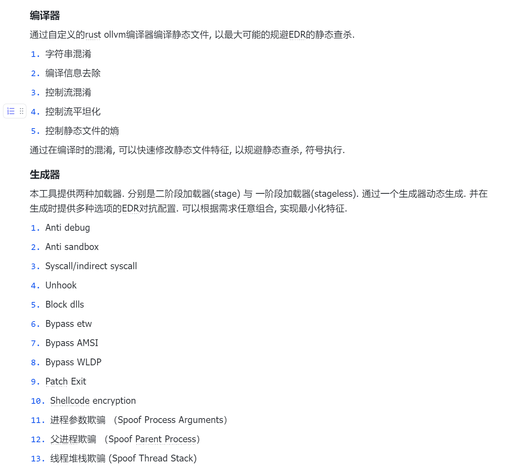

## 背景

近年来开展的大量攻防活动将网络安全行业推向了实网对抗(Real World), 而不再是模拟环境(CTF), 理论环境(传统网络安全建设)的对抗. 在实网对抗中, 攻击方延申出了三个主要的细分领域:

1. pre-exploit 通过各种方式的信息收集, 找到可以exploit的目标, 这个方向发展出了ASM(攻击面管理), Cyberspace-Mapping(网络空间测绘), VM(漏洞管理)等细分领域的产品.
2. exploit  这个方向有传统的Scanner(自动化扫描器), 今年来也出现了新兴领域 BAS(入侵模拟), Exploit-Framework(漏洞利用框架), Exploit-Platform(漏洞知识库/漏洞交易平台)等等
3. post-exploit 后利用, 这个领域的防守方今年来衍生出了`*DR/HIDS`(端上防护), SOAR(自动化响应), CTI(威胁情报)等等, 但在攻击方视角中, 全部的对抗都凝缩在AS(攻击模拟, 可以理解为C2/Webshell)上. 

上门每个提到的细分领域都在近些年来出现了对应的创业公司, 有不少已经成长为庞然大物. 唯有C2, 可能因为其特殊性, 在国内并没有出现对应的生态. 而在国外出现了不少这个领域(offensive security领域)的创业公司.

在技术需求上, 几乎所有企业的绝大部分安全预算都用在对C2(以及相关衍生技术)的防护上, 但在国内却缺少对应的模拟能力. 不论是甲方建设内部蓝军, 亦或是为了红蓝对抗需求的乙方红队或独立红队都需要一套基础设施来模拟或检测. 红蓝对抗的效果是远远优于依赖僵硬的playbook的BAS的.

近年来大型企业都建立了自己的蓝军, 但安全行业只提供防护类产品, 蓝军面临着光有人, 其他的一切都得自己搭建的问题. 

## 生态

https://howto.thec2matrix.com/ 调研了较为主流的C2框架. 

基于自身的经验, 也对我使用过的框架简单总结优缺点. 

### 国外商业化产品

* [CobaltStrike](https://www.cobaltstrike.com/) 开发商outfrank, 近些年最流行的C2框架, 凭借着方便的GUI, 极高的拓展性, 社区以及二开便利优势拿下了最高的市场占有率.  并有一系列的相关领域的工具链, https://www.outflank.nl/products/outflank-security-tooling/ . 随着4.5版本的源码泄露, 有越来越多的基于其源码二开的框架.
* [Metasploit](https://www.metasploit.com/) 开发商rapid7, 拥有最全面的exploit与post-exploit 框架, 市面上能见到的绝大部分自研C2不是基于CS二开就是基于MSF二开.  但也因为过于笨重以及在teamserver方面的劣势, 在实战中并不常见.  有一个基于MSF的teamserver与gui化的开源项目 https://github.com/FunnyWolf/Viper
* [nighthawk](https://www.mdsec.co.uk/nighthawk/) 来自英国的商业化C2框架, 专注opsec, 但因为无公开流出版本, 没有深度体验.  
* [bruteratel](https://bruteratel.com/) 来自美国商业C2框架, 近期有流出版本, 有被apt,勒索组织使用案例. 

### 开源生态

* [sliver](https://sliver.sh/)  开发商bishopfox. 一个新兴的开源C2. 拥有许多独特的功能, 例如cursed, 密码学安全的流量特性等, 以及自己的生态armory. 
* [havoc](https://github.com/HavocFramework/Havoc) implant基于C开发, 通过兼容BOF获得了不少CS的能力. 
* [mythic](https://github.com/its-a-feature/Mythic) 本质上是一套通讯协议， 实现了这个通讯协议的agent可以与这个框架交互.

#### 小结

从基础功能上来说, C2框架之间大同小异, 稳定运行的implant, 适合团队协作的teamserver, 便利的客户端. 商业化C2与开源C2最大的区别是在EDR对抗上, 其中做得比较好的是nighthawk与cobaltstrike, 他们拥有大量未公开的EDR对抗技术, 并有良好的工程化与自定义方案。

而在国内并不缺少单独的EDR对抗技术, 有大量公开或未公开的技术在开源世界或者私下流传, 但缺少一个可以高度定制化的框架将这些独立的技术工程化, 使其变成一个统一的基础设施. 

nighthawk与cobaltstrike都是闭源的工具, 他们虽然提供了各种接口以供用户客制化, 但在最核心的部分, 因为缺少代码, 只能依赖其官方迭代. 并且nighthawk与cobaltstrike都有严格的对中国出口限制.

**最重要的是, 国内的环境诞生了一系列强大的webshell管理工具, 他们实际上也是某种意义上的C2, 从工程上来看, 理论上能完全复用C2的后渗透基建.**

可以想象一个能调用cobaltstrike的cna脚本的冰鞋/哥斯拉有多么强大! 

## 架构/architecture

**进攻是最好的防御.**

Internal of Malice(恶联网) 力图实现一套post-exploit基础设施, 在兼容CS,MSF,Sliver生态的同时, 提供更高的拓展性与隐蔽性, 并提供一套工程化的解决方案.

组件(WIP为目前尚未实现的部分):

- server 数据处理与交互服务
- 监听器(listener), 与server解耦, 可以独立于server单独部署 
  - 反向连接器, 用来接收反连数据
  - 正向连接器, 用来连接webshell或者正向连接的implant  (WIP)
- 植入物(implant), 并能接受任意语言编写的插件
  - 基于rust的全平台反向植入物
  - 基于webshell的正向植入物(WIP)
  - loader generator (WIP)
  - ollvm 编译器 (WIP)
  - webshell/bind , 基于web/其他协议的正向的implant (WIP)
- client 
  - cli 
  - gui   (WIP)
- 插件生态
  - implant端插件
    - armory, sliver的插件生态 
    - BOF,  cobaltstrike的bof插件生态
    - dynamic module, IoM 自身的插件生态
    - UDRL, DLL loader
    - HeadlessPE, PEloader
    - CRL(C# loader)
    - Unmanaged powershell
    - ......

  - server端插件


安全的对抗几乎都集中在post-exploit上, 在pre-exploit上, 防守方能做的只有收敛攻击面， 在exploit对抗上只能做好VM解决1day/nday问题。 这两者加起来, 都对0day无能为力, WAF这类流量设备进行的抵抗不足为惧, 真正能解决这个问题的, 是在post-exploit过程中的对抗. post-exploit对抗过程中出现了纵深防护, 态势感知, 零信任等等方法, 出现了长长的一系列产品, 全都是用来与C2对抗. 所以C2是红蓝双方争夺最激烈最重要的高地. 


## 设计

当我们真正开始着手去实现时, 遇到的困难比想象多得多.

我调研了开源世界中大部分知名C2的架构与实现, 80%以上C2实际上只实现了命令执行, 上传下载. 说实话很难称得上是C2.

但也发现了有几个实现非常成熟的, 从架构与设计上都非常优雅的框架. 也就是在背景中提到过的sliver, havoc, mythic. 这三个框架的架构完全不同, 各有各的优缺点. 其中sliver是最年轻的框架, 其架构也是最符合现代设计理念的C2框架. 

### 通讯设计

sliver的implant/client/server都通过go实现, 并使用grpc作为其通讯协议. 

client与server通过 protobuf 提供的rpc通讯, server与implant通讯则是将数据包封装为统一的`Envelope` message, 然后对`Envelope`的Data和Type字段进行二次的序列化/反序列化操作, 获得真正的数据. 再在各端之间加上mtls, 对流量进行加密. 

implant端则通过一个`handler`去分发数据到各个模块, 模块的执行结果同样通过`Envelope`返回到server中. 

sliver的多信道支持基于go非常优雅的conn相关的抽象, 服务端只需要实现`listener`和`accept`, 在implant实现`dialer`. 就能让实际的通讯协议隐藏在`conn`下, 大部分go的代理工具也是都是这样设计. 可以很快拓展出各种各样的通讯信道. 这一点go对比其他语言的优势非常大.  现在的sliver不支持icmp信道, 但是如果想要拓展, 几乎不需要什么修改, 两三行的修改即可运作. 

sliver默认提供的是正向链接, 并通过mtls加密. 它的beacon(反向连接)并不如正向稳定.

而sliver最优雅的设计就是这一套通讯设计.  我们沿用其部分设计, 例如implant/client/server之间的通讯通过protobuf定义. 但我们没有使用`Envelope`这种需要两次反序列化的设计. 而是采用了protobuf3 提供的`oneof`实现了类似的功能. 就像这样:

```
message Spite {
  string name = 1;
  uint32 task_id = 2;
  bool  async = 3;
  uint64 timeout = 4;
  uint32 error = 5;
  Status status = 6;

  oneof body {
    Empty empty = 10;
    Block block = 11;
    AsyncACK async_ack = 13;
    Register register = 21;
    Ping ping = 22;
    Suicide suicide = 23;
    Request request = 24;
    Response response = 25;
    LoadModule  load_module = 31;
    Modules  modules = 32;
    Extensions extensions = 40;
    LoadExtension load_extension = 41;
    ExecuteExtension execute_extension = 42;
    ...
  }
}
```

 #### 解耦Listener

把server和listener放在一起是很危险的行为. 现代化的C2设计中, 很常见的选择是添加一个`redirector`, 用来转发数据来实现回连的分布式.  但可能会面临这样一个问题, `redirector`只能转发原样的数据, 既然已经被发现了, 原本的流量特征很有可能已经被识别了, 就算通过`redirector`自动切换备用线路或者域前置, 也逃不过再次应急. `redirector`的作用就只是隐藏真实的server地址, 能不能做得更多呢?

只需要换个思路, 既然转发器不适合, 那就直接部署Listener, 是一个有完整数据解析处理能力的边缘节点. 既可以实现隐藏主服务器, 也可能做得更多. 例如, 当一个`redirector` 发生断联时, implant会尝试使用完全不同的协议连接到备用的listener中.  这个完全不同的协议可以是协议特征不同, 也可以协议的传输层都不同. 

解耦出来的Listener还可以做得更多, 在IoM的整体设计中包含了webshell相关的功能, Listener还可以作为流量的出口节点实现与webshell交互的相关功能.

### 插件生态

经过多年的发展，MSF、CobaltStrike、Sliver这些工具都积累了庞大的插件生态与社区支持。IoM尝试了最大可能的兼容已有的插件生态。 

#### implant端插件

已兼容的插件生态:

- ReflectiveDLL
- CRL生态，兼容能运行在CRL运行时中的二进制文件
- CobaltStrike的BOF生态
- Powershell生态
- PE生态, 兼容绝大多数的PE文件

##### malice module

在兼容已有的插件生态的同时， 我们也推出了自己插件格式。

能够反射加载采用本工具指定结构的模块，默认使用rust编写；同时支持实现了FFI接口的其他语言的二进制文件，实现跨语言的模块热加载。

通过malice module编写的插件能在编译时被自由的组装，根据不同的场景按需生成不同的implant

#### 用户侧插件

CobaltStrike提供了Aggressive Script作为用户侧的插件编写语言, [xiebroC2](https://github.com/INotGreen/XiebroC2) 则使用lua作为插件编写的语言. sliver中则使用了SDK实现这个需求，protobuf+grpc几乎天然得实现了多语言的SDK. 暂未发布的sliver1.6还通过非交互式的命令行能实现通过sh/cmd脚本调用client实现类似能力.

IoM采用了与sliver类似的通讯设计, 因此也自然而然能导出一个基于protobuf+grpc的多语言SDK, 通过protobuf生成的SDK能覆盖大多数语言(来自google的顶级跨语言支持). 

##### 兼容Armory

从上文也能看得出来, 因为IoM和sliver采用了相似的通讯设计(实际上也复用了sliver大量server/client的代码), 兼容Armory生态也变得顺其自然了. 

 Armory生态分为`alias`和`extension`两大类, 通过 https://github.com/sliverarmory/armory/blob/master/armory.json 作为插件索引. 

可以从索引中找到对应的仓库, 然后下载并动态加载到client/implant中. 

其中`alias`实际上是命令的别名, 将一些较为复杂的用法封装为固定的预设. 

`extension` 则会在implant内存中驻留. 例如大量的BOF插件都是通过extension实现的, 首先会注册`coff-loader`到implant的extension标中. 然后后续执行的extension如果`extension.json`中存在`"depends_on": "coff-loader"` 则会使用implant中对应的extension去加载这个extension.

我们只需要在IoM中实现类似的操作, 并将其对接即可完美兼容armory. 

##### 兼容CNA

其中拥有最大社区生态的CobaltStrike的CNA插件如果能被迁移到IoM中， 可以省去很多迁移与重复开发时间.  这个目前来看还有很有挑战性. 

`Aggressive Script` 基于[`Sleep`语言](http://sleep.dashnine.org/)实现, 目前这个语言只有java的实现. 如果要兼容CNA脚本, 首先需要能解析这个语言的前端, 然后在其中注册与CobaltStrike中的每个API. 将每个API与IoM中的rpc实现同等功能的对接. 这里面的工作量非常大, 因此暂时我们还见不到这个功能.

### 端上对抗

现代C2框架最重要的是如何设计opsec相关功能.  在IoM中, 我们实现了cobaltstrike能提供的绝大部分用于opsec的对抗. 并加入了更多的我们自己的想法. 

现代EDR（端上检测与响应系统）已经能查杀绝大多数的恶意行为, 从静态查杀、符号执行、HOOK、沙箱等等手段全方位的防护恶意软件. 公开的手段很难躲避现代EDR的查杀. 而后渗透使用到了大量敏感危险的操作, 使得行动很容易暴露在安全设备中.

部分C2为了防止被EDR查杀, 选择采用只有执行命令、上传、下载的先锋马进行操作, 放弃了绝大多数能力, 但不一定是所有场景的最佳选择, 为了与现代化的EDR对抗，更应该采用现代化的武器架构与能力，尽可能的在保留功能的情况下规避EDR的查杀。提高操作者的效率与能力。

端上对抗的效果很大程度上依赖于闭源, IoM的implant不涉及底层api部分的代码将会开源, 可能存在与EDR对抗的部分则会使用有限开源的方式, 将编译好的lib文件. implant主体在编译时将lib静态编译. 

端上对抗演变至今已经有非常多的对抗维度, 这带来最直观的困难就是工程规模, 有无数的组件需要重新实现一遍. 包括但不限于: 

* 静态特征
* 符号执行
* 内存特征
* 行为特征
* 反HOOK反分析
* ...

将这些维度落地到工程中, 就变成了庞大的需求表, 这里是冰山一角.



### 流量对抗

现代NDR（网络检测与响应系统）, 同样在多年的对抗中变得强大无比。从最开始的特征检测，到现在的TLS探针、大数据检测、威胁情报等等手段， 从各方面对恶意软件的通讯过程进行检测与打击。不同于端上对抗， 可以采用自缚双手式的先锋马，流量上的对抗避无可避。 

真正使用过的sliver的人应该都对他的流量相关(代理,端口转发等)的功能有无限的吐槽, 崩溃, 卡顿, 挂死等等问题层出不穷. 一部分原因来自sliver的开发者对这一块的实现有些粗糙有许多会导致implant panic的bug; 最关键的还是设计上的问题, sliver的代理相关功能与其他命令一样. 是通过`Envelope`实现的, 这个设计在分发命令没有什么问题, 在代理这种多路的流式数据中就显得捉襟见肘了. 

要解决这个问题, 只需要把流量相关的功能都拎出来, 与implant彻底解耦, implant端保留了最基本的tcp与tls信道, 更多的拓展功能将通过`Read`与`Write`接口从第三方工具中获取. 正巧, 原本的工具链中就有一个全能的流量代理工具, 现在它又多了一个用途, 当作implant的前置stage. 

IoM的代理与流量隧道的高级功能均通过[rem](/wiki/rem/index)实现.

我们将rem打包成dll, 并暴露出Read与Write接口. 这样上线的不只是implant, 还能直接打通implant端的网络

stage模式:

```mermaid
graph LR
    loader -- 反射加载 --> rem -- 反射加载 --> implant

```

stageless模式:

```mermaid
graph LR
    rem_dll --静态编译--> implant
```

如果不需要rem提供的流量功能, 也可以直接使用implant自带的tcp+tls. 可以在上线再后`execute_pe`加载rem建立代理信道

```mermaid
graph LR
    implant -- execute_pe --> rem
```


IoM默认采用了TCP的方式进行通讯。 并支持TLS与MTLS对通讯流量进行加密. 如果使用了rem作为前置加载器, 则所有的通讯都将被rem接管

更多协议的信道支持与高级的流量对抗的能力, 将通过rem拓展这方面的能力. 请见[rem设计文档](/wiki/rem/design.md)

## Roadmap

我们从一开始的定位就是下一代远控。现在我们只实现了第一阶段的设计， 还将有更多独一无二的特性。

### webshell 支持

我们将结合 webshell 中最先进的技术，以共享同一套插件基建的方式去兼容 webshell 中的各种技术。

### 互联互通

IoM  上的流量隧道不只是点对点的， 还将是网状的，甚至是构建一个受控机器的虚拟网络。

### GUI

受限于各种原因， 我们暂时没有实现一个 GUI，但高效的工具必定会有一个用户体验较好的 GUI。

### 服务端插件

兼容 cobaltstrike 的 cna 插件生态。

实现自己的脚本语言的服务端/客户端插件，通过 lua 或者 yaklang，更或是任意语言的。

### 联动 ASM

通过 IoM  作为跳板， 将 ASM 引入到内网实现自动化的攻击面探测。


对于IoM来说, 在计划中但是还未实现功能实在太多了, 多到没办法通过Todo List展示. 

我们添加了[roadmap.md](wiki/IoM/roadmap.md)用来管理IoM的进度.
