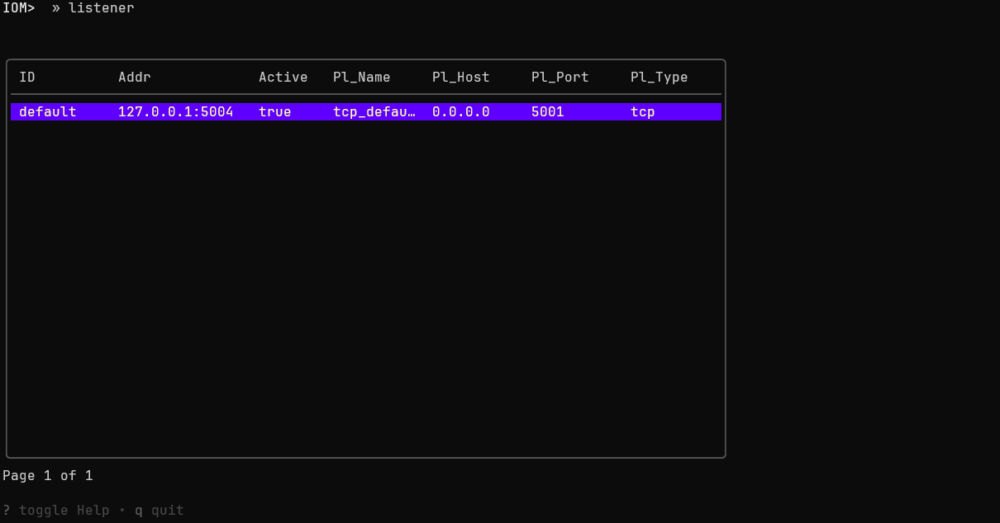
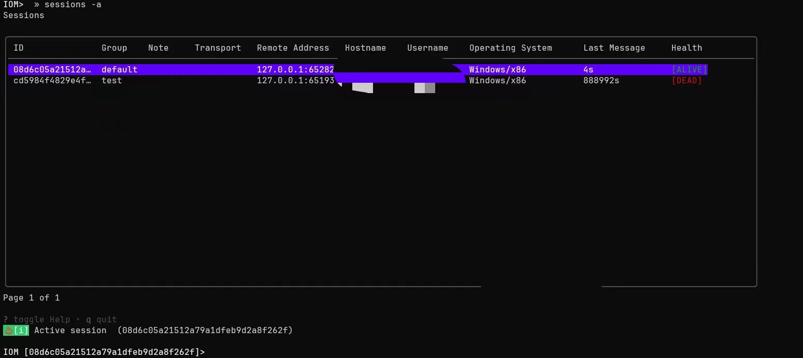
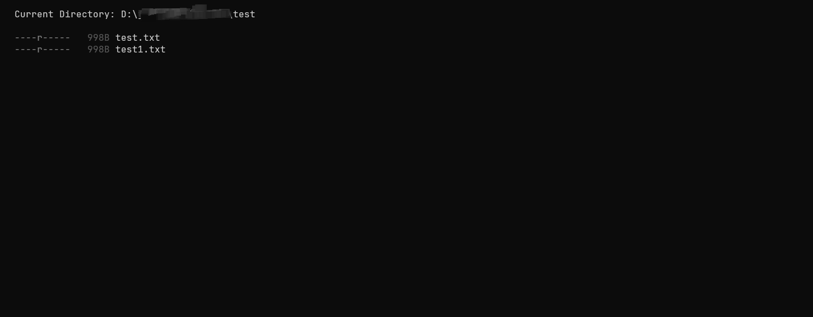

# 用户手册

## 安装

按照以下说明安装 Malice-Network：

1. 为支持的操作系统下载 Malice-Network 服务器版本和客户端版本。

Malice-Network 服务器支持 `Linux`、 `Windows` 和 `MacOS`，但是我们建议在 Linux 主机上运行服务器，因为在 Windows 上，服务器运行某些特性可能更加困难。Malice-Network 客户端在从 Windows 访问 Linux/MacOS 服务器时能正常工作。

1. 运行服务器版本二进制文件。

## 部署

### Server Config

`config.yaml` 是 Malice-Network 服务器的配置文件，其中包含了一些服务器以及 `listener` 可选的配置。

`server` 字段包含了以下服务器配置：

```
    `grpc_host`：gRPC 服务绑定的主机地址。

    `grpc_port`：gRPC 服务绑定的端口号。

    `audit`：日志审计级别设置，`0`为关闭审计，`1`为基本信息审计，`2`为详细审计。

    `packet_length`：数据包长度设置。

    `certificate`：自定义证书相关配置。

    `certificate_key`：自定义证书密钥相关配置项。
```

`listener` 字段包含了以下 `listener` 配置（可独立部署）

```
    `name`：listener名称。

    `auth`：listener身份验证配置文件名。
```

`tcp`：TCP 的连接配置选项:

```
    `name`: TCP配置连接名称。

    `host`：TCP连接绑定的主机地址。

    `port`：TCP 连接使用的端口号.

    `protocol`：使用的协议类型。

    `enable`：TCP 配置项是否启用。
```

`tls`：TLS 配置:

```
    `enable`：TLS配置是否启用。

    `CN`：TLS 证书的通用名称。

    `O`：TLS 证书的组织名称。

    `C`：TLS 证书的国家代码。

    `L`：TLS 证书的城市。

    `OU`：TLS 证书的组织单位。

    `ST`：TLS 证书的州或省份。

    `validity`：TLS 证书的有效期。
```

`encryption`：加密配置：

```
    `enable`：加密是否启用。

    `type`：加密类型。

    `key`：加密密钥。
```

`websites`：网站配置列表：

```
    `websiteName`：网站名称。

    `port`：网站使用的端口号。

    `rootPath`：网站的根路径。

    `enable`：网站配置项是否启用。
```

配置样例:

```bash
ca: .
opsec: true

server:
  grpc_port: 5004
  grpc_host: 127.0.0.1
  audit: 1  _# 0 close , 1 basic , 2 detail_
_  _config:
    packet_length: 100 _# 1M:_
_    _certificate:
    certificate_key:

listeners:
  name: default
  auth: default.yaml
  tcp:
    - name: tcp_default
      port: 5001
      host: 0.0.0.0
      protocol: tcp
      enable: true
      tls:
        enable: false
        CN: "test"
        O: "Sharp Depth"
        C: "US"
        L: "Houston"
        OU: "Persistent Housework, Limited"
        ST: "State of Texas"
        validity: "365"
      encryption:
        enable: false
        type: aes-cfb
        key: maliceofinternal
  websites:
    - websiteName: test
      port: 10049
      rootPath: "/"
      enable: false
```

### 启动 Server

**Malice-Network** 服务器是能与控制 `Implant` 并与 **Malice-Network** 客户端交互的主机。服务器还存储了部分 **Malice-Network** 收集的数据，并管理日志记录。**Malice-Network** 服务器必须和 `config.yaml` 在同一个目录下。要启动 **Malice-Network **服务器，请根据不同操作系统进行以下操作：

a. 对于 Linux：

```
     i. 输入以下命令：
```

```bash
bash
cd /path/to/malice-network-server
./malice-network-server
## 后台挂起
./malice-network-server --daemon
```

b. 对于 MacOS X：

```
     i. 输入以下命令：
```

```bash
bash
cd /path/to/malice-network-server
./malice-network-server
```

c. 对于 Windows

```
    i. 输入以下命令：
```

```powershell
powershell
cd "C:\path\to\malice-network-server"
.\malice-network.exe
```

如果配置文件非默认的 `config.yaml`, 可以通过 `-c path/any.yaml` 指定

启动后服务器会输出以下信息：


### 初始化客户端用户

**Malice-Network** 客户端需要使用用户配置文件才能与服务端进行交互。用户配置文件中包含由服务端生成的证书信息。每次客户端尝试连接服务端时，服务端都会校验该证书信息，以确保用户的合法性。这一过程保证了只有经过认证的用户才能访问和使用 **Malice-Network** 服务，从而提升了系统的安全性和可靠性。

在确保 **Malice-Network** 服务器已经运行后，在终端输入以下指令：

```powershell
powershell
cd "C:\path\to\malice-network-server"
.\malice-network-server.exe user add username
```

执行命令成功后，服务端会输出以下信息并在所处文件夹下生成对应用户配置文件：


用户配置文件中包含了以下信息：

`operator`: 客户端名称。

`lhost`：客户端所连接的服务器地址。

`lport`：客户端所连接的服务器端口号。

`type`：配置类型分为 client 和 listener，用户配置为 client。

`ca` **certificate**：服务端生成的 CA 证书，用于验证服务端的合法性。

`privatekey`：客户端的私钥，用于加密和解密数据。

`certificate`: 客户端的证书，用于向服务端证明客户端的合法性。

### 启动客户端

将生成的用户配置文件复制到 `Malice-Network` 客户端的所在位置。使用新的用户配置文件时，可以使用以下指令启动客户端：

```powershell
powershell
cd "C:\path\to\malice-network-client"
.\malice-network-client.exe .\username_host.yaml
```

执行命令后，客户端会自动使用新的客户配置文件与服务器连接，并将用户配置文件移动至客户端的用户配置文件夹 (Windows 下为 `C:\Users\user\.config\malice\configs`,MacOS X 为 `/home/username/.config/malice/configs`，Linux 为 `/Users/username/.config/malice/configs`）

客户端登录成功后会输出以下信息：


下次登录后，客户端会自动显示在用户配置文件夹下所有的用户配置，根据需求，选择对应的用户进行选择。Linux 端使用命令启动 **Malice-Network** 客户端，Windows 和 MacOS X 可以双击 **Malice-Network** 客户端可执行文件启动客户端。

a. 对于 Linux：

```bash
bash
cd \path\to\malice-network-client
.\malice-network-client
```

b. 对于 MacOS X：

c. 对于 Windows：

i. 导航到 Malice-Network 文件夹。

ii. 双击 `malice-network-client.exe`。


### 启动 Listener

Server 的 `config.yaml` 中已经包含了 listener 配置。 是对 server 与 listener 在同一台机器上部署时的简化。

listener 将始终保持独立， 并通过 grpc 与 server 进行交互， 包括注册、启动、关闭、删除等功能。

**Malice-Network** 将提供独立的 listener 二进制文件，通过加载 listener.yaml 在任意机器上部署，并连接到 server， 接受 server 的调度。

`listener.yaml` 的配置格式与 `config.yaml` 中的 listener 部分完全一致.

a. 对于 Linux：

```
     i. 输入以下命令：
```

```bash
bash
cd /path/to/malice-network-server
./listener 
## 后台挂起
./listener --daemon
```

b. 对于 MacOS X：

```
     i. 输入以下命令：
```

```bash
bash
cd /path/to/malice-network-server
./listener
```

c. 对于 Windows

```
    i. 输入以下命令：
```

```powershell
powershell
cd "C:\path\to\malice-network-server"
.\listener.exe
```

如果配置文件非默认的 `listener.yaml`, 可以通过 `-c path/any.yaml` 指定.

配置样例:

```bash
listeners:
  name: default
  auth: default.yaml
  tcp:
    - name: tcp_default
      port: 5001
      host: 0.0.0.0
      protocol: tcp
      enable: true
      tls:
        enable: false
        CN: "test"
        O: "Sharp Depth"
        C: "US"
        L: "Houston"
        OU: "Persistent Housework, Limited"
        ST: "State of Texas"
        validity: "365"
      encryption:
        enable: false
        type: aes-cfb
        key: maliceofinternal
```

需要注意的是, 非本机部署的 listener, 需要提供 `auth.yaml` 配置，auth 配置需要在添加用户后生成.9

## 用户交互

### Pipeline 管理

目前每个 `listener` 中都会有多个 `Pipeline` 与对应的 `Implant` 进行连接。在客户端可以输入 `listener` 控制指令查看 `listener` 下的所有 `Pipeline`。



### Session 管理

在 `Malice-Network` 中，`Session` 是与目标系统进行交互的核心概念。每一个 `Session` 代表着与目标主机的一个活动连接，通过该连接，您可以执行各种操作和命令。

#### session

`Session` 表将展示服务器中存储的 `Session` 信息，输入以下指令可以查看 `Session` 表：

```bash
sessions    # 查看当前仍在活动的sessions
sessions -a # 查看所有sessions
```

在 `Session` 表中可以上下选择需要的 `Session`，按下回车键后，客户端会通知服务端使用该 `Session` 与对应 `Implant` 进行交互。



`session` 是用于会话操作的命令。您可以通过提供会话 ID 和其他标志来执行不同的操作。

**使用**

```bash
session [--note <note>] [--group <group>] [--delete] <id>
```

**参数**

- `id`：会话 ID，必须提供。

**标志**

- `--note` 或 `-n`：会话备注。用于指定会话的备注信息。
- `--group` 或 `-g`：会话组。用于指定会话所属的组。
- `--delete` 或 `-d` ：删除会话。标志为 `true` 时，表示删除指定的会话。

**示例**

1. **添加备注到会话**

```bash
session --note "This is a test session"  session_id
```

1. **指定会话所属的组**

```bash
session --group "test-group" session_id
```

1. **删除会话**

```bash
session --delete session_id
```

#### use

使用 `use` 指令可以快速通过 `Session_id` 来找到对应的 `Session` 来进行连接。输入 `use` 指令后，按下 `tab` 键，客户端会自动显示可用的 `Session` 连接。

```bash
use session_id
```

#### obverse

监听指定 session_id, 可以在切换到其他 session 上下文时依旧能接收到指定 session 的消息.

```bash
obverse session_id
```

列出所有监听的 session

```bash
obverse
```

删除监听的 session

```bash
obverse remove session_id
```

### Task 管理

通常，我们将您提交的每个任务称为一个 `Task`，服务器会记录下所有的 `Task` 信息，您可以使用 `Tasks` 指令查看 `Task` 表查看任务信息。目前 `Task` 表只会显示 `Upload` 和 `Download` 任务。


### Armory 管理

`Armory` 是 `Alias` 和 `Extension` 的管理器，允许您自动安装各种第三方工具，如 `BOFs` 和 `.NET工具`。为减少使用人员的开发成本，目前我们使用的 `Armory` 与 `Sliver` 的 `Armory` 标准一致。

`Armory` 从 github.com 和 api.github.com 下载包，所以您需要一个互联网连接才能使命令工作。该命令支持代理，并且在安装别名或扩展后，不需要执行别名/扩展就可以连接互联网。

##### `armory`

列出可用的军械库包。

**语法**

armory [--proxy <proxy URL>] [--timeout <timeout>] [--insecure] [--ignore-cache]

标志

- `--proxy` 或 `-p`：代理 URL，用于指定代理服务器。
- `--timeout` 或 `-t`：超时时间。
- `--insecure` 或 `-i`：禁用 TLS 验证。
- `--ignore-cache`：忽略缓存。

示例

```bash
armory --proxy http://proxy.example.com --timeout 30s
```

##### 子命令

**安装**

`install`

用于安装命令军械库。

语法

```bash
armory install <name> [--armory <armory name>] [--force]
```

参数

标志

示例

```bash
armory install my-package --armory main-armory --force
```

**更新**

`update`

更新已安装的军械库包。

语法

```bash
armory update [--armory <armory name>]
```

标志

示例

```bash
armory update --armory main-armory
```

**搜索**

`search`

搜索军械库包

语法

```bash
armory search <name>
```

参数

示例

```bash
armory search package-name
```

### Website 管理

在安全测试和红队操作中，经常需要托管和操作静态文件，例如恶意代码、伪装的网站页面、钓鱼页面等。您能通过命令非常便捷地管理这些静态内容。

##### `website`

管理网站及其内容。

语法

```bash
website
```

##### 子命令

添加内容

**add-content**

添加内容到网站。

语法

```bash
website add-content [--name <name>] [--web-path <web-path>] [--content-path <content-path>] [--content-type <content-type>] [--recursive]
```

标志

示例

```bash
website add-content --name my-website --web-path /path/to/website --content-path /path/to/content/file --content-type text/html --recursive
```

移除内容

**rm-content**

从网站中移除特定内容。

语法

```bash
website rm-content [--name <name>] [--web-path <web-path>] [--recursive]
```

标志

示例

```bash
website rm-content --name my-website --web-path /path/to/website --recursive
```

移除网站

**rm**

移除一个网站。

语法

```bash
website rm [--name <name>]
```

标志

`--name` 或 `-n` ：网站名称。

示例

```bash
website rm --name my-website
```

更新内容

**update-content**

更新网站内容。

语法

```bash
website update-content [--name <name>] [--web-path <web-path>] [--content-type <content-type>]
```

标志

示例

```bash
website update-content --name my-website --web-path /path/to/website --content-type text/css
```

列出内容

**list-contents**

列出网站内容。

语法

```bash
website list-contents --name <name>
```

参数

`name` (string)：网站名称。

示例

```bash
website list-contents --name my-website
```

### Module 管理

##### `list-module`

列出当前可用的模块。

语法

```bash
list-modules
```

##### `load-module`

加载指定的模块。

语法

```bash
load-module [--name <module_name>] [--path <module_path>]
```

标志

示例

```bash
load-module -n exampleModule -p /path/to/module
```

### 文件管理(WIP)

### 日志与审计(WIP)

##### history

### Implant 交互

#### 基本命令

##### `pwd`

打印当前工作目录。

语法

```bash
pwd
```

##### `cat`

打印文件内容。

语法

```bash
cat [--name <file>]
```

标志

`--name`：文件名。

##### `cd`

切换当前目录。

语法

```bash
cd [--path <path>]
```

标志

```
    `--path`：目录路径。
```

##### `chmod`

修改文件模式。

语法

```bash
chmod [--path <path>] [--mode <mode>]
```

标志

##### `chown`

修改文件所有者。

语法

```bash
chown [--path <path>] [--uid <uid>] [--gid <gid>] [--recursive]
```

标志

##### `cp`

复制文件。

语法

```bash
cp [--source <source>] [--target <target>]
```

标志

##### `ls`

列出目录内容。

语法

```bash
ls [--path <path>]
```

标志

```
    `--path` ：目录路径。
```

##### `mkdir`

创建目录。

语法

```bash
mkdir [--path <path>]
```

标志

```
    `--path` ：目录路径。
```

##### `mv`

移动文件。

语法

```bash
mv [--source <source>] [--target <target>]
```

标志

##### `rm`

删除文件。

语法

```bash
rm [--name <file>]
```

标志

```
    `--name` ：文件名。
```

##### `download`

支持您分块下载所需文件，每个块默认大小上限为 1M。

语法

```bash
download [--name <filename>] [--path <filepath>]
```

标志

##### `sync`

同步文件，将服务器上的下载的文件同步到客户端。

语法

```bash
sync [--taskID <task ID>]
```

标志

```
    `--taskID` (string)：任务 ID。
```

##### `upload`

支持您分块上传本地文件， 每个块默认大小上限为 1M。

语法

```bash
upload [--source <source path>] [--destination <target path>] [--priv <file Privilege>] [--hidden]
```

标志

#### Explorer

文件资源管理器是现代操作系统中不可或缺的工具，为用户提供直观的方式来组织、管理和与数字文件和目录进行交互。我们在 `Malice-Network` 也实现了一个 tui 版本的文件资源管理器，它会显示 `Implant` 所在位置的文件目录。您可以在选择 `Session` 之后，通过 `Explorer` 更加方便地与远程文件进行交互。

`explorer`

启动文件资源管理器。

语法

```bash
explorer
```


`Explorer` 下，文件夹以紫色显示，文件则以白色显示。选中文件夹后，使用方向键右键，则可进入文件夹中。




在进入文件夹后，使用方向键左键，则可退回上一级目录。

选中文件后，按下 `d` 键, `Explorer` 会将选中文件下载至服务器，并在终端上，显示下载进度。


按下 `ctrl+c`，即可退出 `Explorer` 模式。

#### Execute

##### exec

执行普通命令。

语法

```bash
exec [command] [arguments...] [-T, --token] [-o, --output] [-s, --save] [-X, --loot] [-S, --ignore-stderr] [-O, --stdout <path>] [-E, --stderr <path>] [-n, --name <name>] [-P, --ppid <pid>] [-t, --timeout <seconds>]
```

参数:

标志

示例

```bash
exec ls -l
```

##### `execut_assembly`

加载并执行.NET 程序集（仅限 Windows）。

语法

```bash
execute_assembly [path] [--name <name>] [-P, --ppid <pid>] [--param <param>] [--need_output]
```

标志

示例

```bash
execute_assembly C:\path\to\assembly.exe arg1 arg2
```

##### `inline_assembly`

在 IOM 中执行给定的内联.NET 程序集（仅限 Windows）。

语法

```bash
inline_assembly [path]
```

参数

`path`：二进制文件的文件路径

示例

```bash
inline_assembly C:\path\to\assembly.exe
```

##### `execute_shellcode`

在当前进程中执行给定的 shellcode。

语法

```bash
execute_shellcode [filepath] [--param <param>] [-p, --ppid <pid>] [-b, --block_dll] [--sacrifice]
```

参数

`filepath` ：要注入的 shellcode 的文件路径。

标志

示例

```bash
execute_shellcode --sacrifice --pid 8888 --output --param "notepad.exe" ./loader.bin
```

##### `inline_shellcode`

在 IOM 中执行给定的内联 shellcode。

语法

```bash
inline_shellcode [filepath] [--param <param>]
```

标志

```
    `--param`：参数，例如将要启动的牺牲进程名称。
```

示例

```bash
inline_shellcode /path/to/inline_shellcode.bin
```

##### `execute_bof`

加载并执行 Bof（仅限 Windows）。

语法

```bash
execute_bof [path] [arguments...]
```

参数

`path`：`BOF` 的文件路径

标志

示例

```bash
execute-bof C:\path\to\bof.exe
```

#### Sys

原生实现的系统 api, 比直接的命令执行更加

##### `whoami`

打印当前用户。

语法

```bash
whoami
```

##### `kill`

杀死进程。

语法

```bash
kill --pid <Process ID>
```

选项

```
    `--pid`：要杀死的进程的进程ID。
```

##### `ps`

列出进程。

语法

```bash
ps
```

##### `env`

列出环境变量。

语法

```bash
env
```

##### `set-env`

设置环境变量。

语法

```bash
set-env --env <Environment variable> --value <Value>
```

标志

##### `unset-env`

取消环境变量。

语法

```bash
unset-env --env <Environment variable>
```

标志

```
    `--env`：要取消的环境变量。
```

##### `netstat`

列出网络连接。

语法

```bash
netstat
```

## Implant

考虑到红队人员的使用习惯， 本 `Implant` 所支持的命令将大量沿用 `CS` 工具的命令及使用习惯

### Implant Config

`Implant` 同样拥有一个 `config.yaml` 以对生成的 `implant` 进行配置：

`Server` 字段包含了以下连接配置:

`urls`: `implant` 所需要建立连接的目标 `ip` 或 `url` 列表

`port`: `implant` 所需要建立连接的目标端口

`interval` :  每次建立连接的时间间隔(单位为 `milliseconds`)

`jitter`: 每次建立连接时的时间间隔抖动(单位为 `milliseconds`)

`Implant` 字段包含以下可选生成物配置：

`target_os`: 目标系统（`windows`, `linux`, `macos`)

`target_arch`:目标架构（`x86`, `x86_64`)

`modules`: 生成物所需要包含的功能模块， 如默认提供的 `base` 基础模块及 `full` 全功能模块， 或自行组装所需功能模块, 详见章节 `Extension` 部分

`metadata`: 生成物元特征：

`apis_level`: 修改生成物调用 `API` 等级， 如直接调用系统 API `sys_apis`, 动态获取 `dynamic_apis` 或尽可能使用自实现系统调用 `syscalls`

`alloctor`: 默认内部分配器及对应释放和权限设置函数，`VirtualAlloc`, `VirtualAllocEx`, `HeapAlloc`, `NtAllocateVirtualMemory`

`alloctor_ex`: 默认外部分配器及对应释放和权限设置函数， `VirtualAllocEx`, `NtAllocateVirtualMemory`

`mem_rw_ex`: 默认外部内存读写函数， `ReadProcessMemory`, `NtReadVirtualMemory`

`sleep_mask`: 睡眠混淆是否开启

`sacriface_process`: 是否需要牺牲进程功能

`fork_and_run`: 是否需要使用 `fork and run` 机制

`hook_exit`: 是否需要对退出函数进行 `hook` 以防止误操作导致的退出

`thread_task_spoofer`: 是否需要自定义线程调用堆栈

### 编译环境

`Implant` 支持在多个系统中进行编译操作， 但我们建议在 `Linux` 主机编译，由于 `implant` 使用 `Cargo` 来进行管理， 因此您需要安装 `Cargo` 来进行编译， 获取 `Cargo` 最简单的方式是使用 `rustc` 脚本

```shell
$ curl -sSf https://static.rust-lang.org/rustup.sh | sh
```

除此之外， 编译 `Implant` 需要用到 `rust` 的 `nightly` 版本， 您可以通过使用下面的命令来安装和切换到 `nightly` 版本

```shell
rustup install nightly
rustup default nightly
```

### APIs

在 `EDR` 的对抗分析中， 我们支持在组装 `Implant` 时由用户自行选择使用各级别的 `API`， 如直接调用系统 `API`, 动态获取并调用， 通过 `sysall` 调用，这可以有效减少程序 `Import` 表所引入的的特征

在 `syscall` 调用中， 我们支持使用各类门技术来调用系统调用而非直接调用用户层 `API`， 以防止 `EDR` 对常用红队使用的 `API` 进行监控， 如何配置可见 `Implant Config File` 对应 `apis_level` 部分

### Process

#### Process inject

#### Process hollow

在用户有调用 `PE/Shellcode` 各类格式的需求时， `Implant` 支持 `Process Hollow` 技术， 以伪装用户的调用需求

#### Sacrifice Process

Fork&Run 虽然已经不是 opsec 的选择， 但是某些情况下还是避不开使用这个技术。

为便于理解， 您可以将所有需要产生新进程的行为均理解为生成了一个 `牺牲进程`， 即包含下面将阐述的所有概念及功能

所有上述支持使用 `Sacrifice Process` 即 `牺牲进程` 的功能都会可以通过参数 `--sacrifice` 开启， 所有 `牺牲进程` 都是以 `SUSPEND` 及 `NO_WINDOWS` 的形式启动的， 在做完其余处理后再唤醒主线程， 您可以通过 `--param` 参数向 `牺牲进程` 传递启动参数， 如 `notepad.exe` , 并通过 `--output` 参数来决定是否需要捕获输出（如果您不确定执行结果是否有可获取的结果， 请小心使用 `output` 以避免 `Implant` 错误的等待一个可能永远不会得到的结果

支持牺牲进程的功能有:

- execute (默认启动牺牲进程， 无需增加参数）
- execute_pe
- execute_shellcode

我们也为 pe，shellcode 提供了更加 opsec 的 inline 版本(inline_pe/inline_shellcode).

接下来我们将以 `execute_shellcode` 功能来举例说明

```bash
# 命令示例
execute_shellcode --sacrifice --output --param "notepad.exe" ./loader.bin
```

#### Alternate Parent Processes

所有上述支持 `牺牲进程` 的功能均可以自定义 `牺牲进程` 的 `ppid`, 只需在调用命令时添加 `--pid` 参数即可

您可以使用 `ps` 命令获取当前所有进程的快照内容

```bash
# 命令示例
execute_shellcode --sacrifice --pid 8888 --output --param "notepad.exe" ./loader.bin
```

#### Spoof Process Arguments

由于所有的牺牲进程都会以 `SUSPEND` 参数启动， 因此在执行命令时， 我们可以对从启动到真正执行时的参数进行替换， 即调用函数进行启动时为假的命令， 真正启动时变为真的命令

您可以使用 `argue` 命令来保存您的假命令， 如

```bash
# 命令示例
argue net fake_net
```

随后在牺牲进程启动时， 如传入参数为 `net` 将会替换为 `fake_net` 命令启动, 在执行命令时以 `net` 正确执行

```bash
# 命令示例
execute --ppid 8888 --output --param "net xxxx xxx"
```

只需如此调用， 启动时将会自动变为 `fakenet xxxx xxx`， 而在真实调用时变为 `net xxxx xxx`

### Memory

### Syscall

### Blocking DLLs

使用 `blockdlls start` 命令来使得以后启动的所有牺牲进程均需要验证将要加载的 `DLL` 的签名， 非微软签名的 `DLL` 将会被禁止加载于我们的 `牺牲进程中`, 使用 `blockdlls stop` 命令来结束这一行为

该功能需要在 `Windows 10` 及以上系统中使用

## Extension

Implant 支持多种方式动态加载及调用各类插件及功能, 支持架构/位数及功能详见如下表

1. 隐藏部分

| 目标系统 | 目标架构    | sleep_mask | obfstr | fork&run | thread_stack_spoof | syscall | dynamic_api |
| -------- | ----------- | ---------- | ------ | -------- | ------------------ | ------- | ----------- |
| windows  | x86         | ✗         | ✓     | ✓       | ✓                 | ✓      | ✓          |
|          | x86_64      | ✓         | ✓     | ✓       | ✓                 | ✓      | ✓          |
|          | arm/aarch64 | ✗         | ✓     | ✓       | ✓                 | ✗      | ✓          |
| linux    | intel       | ✗         | ✓     | ✗       | ✗                 | ✗      | ✗          |
|          | arm         | ✗         | ✓     | ✗       | ✗                 | ✗      | ✗          |
|          | mips        | ✗         | ✓     | ✗       | ✗                 | ✗      | ✗          |
| macOS    | intel       | ✗         | ✓     | ✗       | ✗                 | ✗      | ✗          |
|          | arm         | ✗         | ✓     | ✗       | ✗                 | ✗      | ✗          |

1. 功能部分

| 功能                             | windows-x86 | windows-x86_64 | windows-arm* | linux-x86_64 | linux-arm | linux-aarch64 | macOS-intel | macOS-arm |
| -------------------------------- | ----------- | -------------- | ------------ | ------------ | --------- | ------------- | ----------- | --------- |
| fs_ls                            | ✓          | ✓             | ✓           | ✓           | ✓        | ✓            | ✓          | ✓        |
| fs_cd                            | ✓          | ✓             | ✓           | ✓           | ✓        | ✓            | ✓          | ✓        |
| fs_mv                            | ✓          | ✓             | ✓           | ✓           | ✓        | ✓            | ✓          | ✓        |
| fs_pwd                           | ✓          | ✓             | ✓           | ✓           | ✓        | ✓            | ✓          | ✓        |
| fs_mem                           | ✓          | ✓             | ✓           | ✓           | ✓        | ✓            | ✓          | ✓        |
| fs_mkdir                         | ✓          | ✓             | ✓           | ✓           | ✓        | ✓            | ✓          | ✓        |
| fs_chomd                         | ✗          | ✗             | ✗           | ✓           | ✓        | ✓            | ✓          | ✓        |
| fs_chown                         | ✗          | ✗             | ✗           | ✓           | ✓        | ✓            | ✓          | ✓        |
| fs_cat                           | ✓          | ✓             | ✓           | ✓           | ✓        | ✓            | ✓          | ✓        |
| net_upload                       | ✓          | ✓             | ✓           | ✓           | ✓        | ✓            | ✓          | ✓        |
| net_download                     | ✓          | ✓             | ✓           | ✓           | ✓        | ✓            | ✓          | ✓        |
| sys_env                          | ✓          | ✓             | ✓           | ✓           | ✓        | ✓            | ✓          | ✓        |
| sys_kill                         | ✓          | ✓             | ✓           | ✓           | ✓        | ✓            | ✓          | ✓        |
| sys_whoami                       | ✓          | ✓             | ✓           | ✓           | ✓        | ✓            | ✓          | ✓        |
| sys_ps                           | ✓          | ✓             | ✓           | ✓           | ✓        | ✓            | ✓          | ✓        |
| sys_netstat                      | ✓          | ✓             | ✓           | ✓           | ✓        | ✓            | ✓          | ✓        |
| sys_exec                         | ✓          | ✓             | ✓           | ✓           | ✓        | ✓            | ✓          | ✓        |
| sys_command                      | ✓          | ✓             | ✓           | ✓           | ✓        | ✓            | ✓          | ✓        |
| sys_execute_shellcode            | ✓          | ✓             | ✓           | ✓           | ✓        | ✓            | ✓          | ✓        |
| sys_execute_assembly             | ✓          | ✓             | ✓           | ✗           | ✗        | ✗            | ✗          | ✗        |
| sys_execute_unmanaged_powershell | ✓          | ✓             | ✓           | ✗           | ✗        | ✗            | ✗          | ✗        |
| sys_execute_pe                   | ✓          | ✓             | ✓           | ✗           | ✗        | ✗            | ✗          | ✗        |
| sys_execute_bof                  | ✓          | ✓             | ✓           | ✗           | ✗        | ✗            | ✗          | ✗        |
| hot_module_load                  | ✓          | ✓             | ✓           | ✓           | ✓        | ✓            | ✗          | ✗        |

### Dynamic Module

`Implant` 的自带功能被称为 `Module`, 所有的 `Module` 均可以在组装 `Implant` 时自行拆卸组装， 随后在运行时使用 Load module 功能即可动态安装功能， 加载成功后， 可使用 `list_module` 功能遍历现有功能模块以使用

如何组装模块可参照 `Implant Config File` 部分及前述功能表， 默认提供两种组装模式:

1. Full 功能表中对应系统及架构支持的全部功能
2. Base  (` "fs_ls", "fs_cd", "fs_rm", "fs_cp","fs_mv", "fs_pwd", "fs_cat",  "net_upload", "net_download", "sys_exec", "sys_env"`)

您也可以根据喜好自行组装功能模块， 当然， 由于我们提供了动态加载及卸载模块的功能， 您可以随时添加新模块

请注意， 生成时组装的模块永远无法被卸载， 因此在极端情况下请斟酌选用， 但虽然无法卸载， 但加载新模块时如您选用了同样名称的模块， 新模块将覆盖本体的模块， 以提供一些灵活性

关于生成后的模块管理， 具体请参考 `Post Exploitation` 章节中 `Modules` 这一小节的内容

#### Implant module manager

就像开始所说的那样， 我们的 `Implant` 支持您生成时组装所需功能模块， 同时也支持您在 `Implant` 启动后动态的加载和卸载所需的功能模块， 因此我们也提供了 `Modules` 管理命令

- `list_modules` 命令允许您列举当前 `Implant` 所持有的模块
- `load_modules` 命令则支持您动态加载本地新组装的模块， 只需要 `load_modules --name xxx --path module.dll` 即可动态加载新的模块， 请注意， 如本体已经含有的模块（生成时组装的模块）， 再次加载将会覆盖该模块的功能， 是的， `load_modules` 允许您修改本体功能以满足您的需求
- `unload_modules` 命令则会卸载您使用 `load_modules` 命令所加载的对应 `name` 的模块， 请注意， 生成时确定的模块是无法卸载的， 但这些模块可以被您加载的新模块所覆盖
- `refresh_modules` 命令将会卸载所有动态加载的模块， 包括您覆盖掉的本体模块， 一切模块将恢复成您生成时的初始状态

#### 模块开发

当然， 您也可以自行编写您自己别具特色的 `Module` ， 我们提供了灵活的编写接口及解析规范

**proto**

对于有 `proto` 编写习惯的开发人员， 您可以在 `implant.proto` 中自行添加自己的 `proto` 规则

而对于没有 `proto` 编写习惯或经验的开发人员， 我们也留好了预设接口， 即使用 `Request` 和 `Response` 块来进行使用

```protobuf
// common empty request
message Request {
  string name = 1;
  string input = 2;
  repeated string args = 3;
  map<string, string> params = 4;
}
// common empty response
message Response {
  string output = 1;
  string error = 2;
  map<string, string> kv = 3;
}
```

**Module**

1. 泛型声明

在选用您的 `proto` 传输规则后， 就可以开始编写您自己的 `Module` 了，您只需要使用如下泛型

```rust
#[async_trait]
pub trait Module {
    fn name() -> &'static str where Self: Sized;
    fn new() -> Self where Self: Sized;
    fn new_instance(&self) -> Box<MaleficModule>;
    async fn run(&mut self,
                 id: u32,
                 recv_channel: &mut Input,
                 send_channel: &mut Output) -> Result;
}
```

由于我们已经实现了一个过程宏 `module_impl`， 因此您无需编写杂余代码， 只需要关注具体功能 `run` 函数即可.

其中参数如下:

`id` : 即为 Task_id， 在前面的段落中我们提到，每一个用户提交的任务都被视为一个 `Task`, 并通过唯一的 `Task_id` 来进行任务状态管理

`recv_channel`: 用于接收您所传入需要解析的数据

`send_channel`: 用于将您所需要传出的数据发送给数据处理模块， 以发送给您

返回值

`Result`: 如果您不需要多次传数据， 只需要将返回的数据放入 `Result` 中即可

1. 示例

接下来我们以 `cat` 功能为例带您编写一个 `Module` :)

首先我们需要定义 `Module` 并继承拓展我们的泛型, 下面为一个使用 `response` 和 `request` 的 `proto` 传输数据的基本模版

```rust
use async_trait::async_trait;
use malefic_trait::module_impl;
use crate::{check_request, Module, Result, check_field, TaskResult};
use crate::protobuf::implantpb::spite::Body;

pub struct ModuleName{}

#[async_trait]
#[module_impl("module_name")]
impl Module for ModuleName {
    #[allow(unused_variables)]
    async fn run(&mut self, id: u32, recviver: &mut crate::Input, sender: &mut crate::Output) -> Result {
        let request = check_request!(recviver, Body::Request)?;
        let mut response = crate::protobuf::implantpb::Response::default();
        Ok(TaskResult::new_with_body(id, Body::Response(response)))
    }
}
```

接下来我们将其修改为 `cat` 的基本框架， 您需要修改的地方有两点（结构体名称，`#[module_impl("")]` 宏中的名称， 该名称即为后续在 `Implant` 中所调用功能的名称）

```rust
use async_trait::async_trait;
use malefic_trait::module_impl;
use crate::{check_request, Module, Result, check_field, TaskResult};
use crate::protobuf::implantpb::spite::Body;

pub struct Cat{}

#[async_trait]
#[module_impl("cat")]
impl Module for Cat {
    #[allow(unused_variables)]
    async fn run(&mut self, id: u32, recviver: &mut crate::Input, sender: &mut crate::Output) -> Result {
        let request = check_request!(recviver, Body::Request)?;
        let mut response = crate::protobuf::implantpb::Response::default();
        Ok(TaskResult::new_with_body(id, Body::Response(response)))
    }
}
```

修改后您可以通过 `check_field!()` 这个宏来尝试获取结构体中的内容, 执行命令后将可能的结果填回 `response` 中

```rust
use async_trait::async_trait;
use malefic_trait::module_impl;
use crate::{check_request, Module, Result, check_field, TaskResult};
use crate::protobuf::implantpb::spite::Body;

pub struct Cat{}

#[async_trait]
#[module_impl("cat")]
impl Module for Cat {
    #[allow(unused_variables)]
    async fn run(&mut self, id: u32, recviver: &mut crate::Input, sender: &mut crate::Output) -> Result {
        let request = check_request!(recviver, Body::Request)?;

        let filename = check_field!(request.input)?;
        let content = std::fs::read_to_string(filename)?;

        let mut response = crate::protobuf::implantpb::Response::default();
        response.output = content;

        Ok(TaskResult::new_with_body(id, Body::Response(response)))
    }
}
```

是的， 由于我们做了很多宏， 因此在正常情况下您可以基本忽略错误处理， 只需要关注您本身的功能即可

同样的， 如果您的任务需要多次数据传输和结果发送， 您可以多次调用 `check_request!(recviver, Body::Request)?;` 来获取数据， 并使用 `sender.send()` 函数来发送一个 `TaskResult` 格式的数据

### Dll/EXE

`DLL/EXE` 是 `Windows` 中的可执行程序格式

在使用中， 您可能有动态加载调用 `PE` 文件的需求， 这些文件可能是某个 `EXP` 或某个功能模块， 因此

`Implant` 支持动态加载和调用 `DLL/EXE ` 文件， 并可选择是否需要获取标准输出， 如需要将会把输出发布给您

所有执行的 `DLL/EXE` 都无需落地在内存中直接执行， 通过调用参数来控制 `DLL/EXE` 在自身内存中调用或创建一个牺牲进程以调用， 具体请参照 `Post Exploitation` 章节中 `Running Commands` 和 `Sacrifice Process` 这一小节的内容

### Shellcode

常见的 `Shellcode` 为一段用于执行的短小精悍的代码段，其以体积小，可操作性大的方式广为使用， 因此

`Implant` 支持动态加载 `shellcode`, 并可选择在自身进程还是牺牲进程中调用

请注意，由于 `Implant` 无法分辨您的 `shellcode` 是哪个架构的， 请您在使用该功能时，如果不确定架构和其稳定性， 最好使用 `牺牲进程` 来进行调用， 而非在本体中进行， 以免由于误操作失去连接

具体可参照 `Post Exploitation` 章节中 `Running Commands` 这一小节的内容

### .NET CRL

对于前几年的从事安全工作的从业人员来说, 在 `Windows` 系统上使用 `C#` 编写工具程序十分流行，各类检测及反制手段如 `AMSI` 还未添加进安全框架中, 因此市面上留存了大量由 C#编写并用于安全测试的各类利用和工具程序集。

`C#` 程序可以在 `Windows` 的 `.Net` 框架中运行,而 `.Net` 框架也是现代 `Windows` 系统中不可或缺的一部分。其中包含一个被称为 `Common Language Runtime(CLR)` 的运行时,`Windows` 为此提供了大量的接口,以便开发者操作 `系统API`。

因此， `Implant` 支持在内存中加载并调用 `.Net` 程序,并可选择是否需要获取标准输出。使用者可以参照 `Post Exploitation` 章节中 `Running Commands` 小节的内容,进一步了解相关功能的使用方法。

### Unmanaged Powershell

在红队的工作需求中， 命令执行为一个非常核心的功能， 而现代的 `Powershell` 就是一个在 `Windows` 中及其重要且常用的脚本解释器， 有很多功能强大的 Powershell 脚本可以支持红队人员在目标系统上的工作

因此，针对直接调用 `Powershell.exe` 来执行 `powershell` 命令的检测层出不穷，为避免针对此类的安全检查

`Implant` 支持在不依赖系统自身 `Powershell.exe ` 程序的情况下执行 `Powershell cmdlet` 命令, 具体可参照 `Post Exploitation` 章节中 `Running Commands` 小节的内容,进一步了解相关功能的使用方法。

- 使用 `powershell` 命令来唤起 `powershell.exe` 以执行 `powershll` 命令
- 使用 `powerpick` 命令来摆脱 `powershell.exe` 执行 `powershell` 命令
- 使用 `powershell_import` 命令来向 `Implant` 导入 `powershell script`， 系统将在内存中保存该脚本， 以再后续使用时直接调用该脚本的内容

### BOF

常见的， 一个 C 语言源程序被编译成目标程序由四个阶段组成， 即（预处理， 编译， 汇编， 链接）

而我们的 `Beacon Object File(BOF) ` 是代码在经过前三个阶段（预处理， 编译， 汇编）后，未链接产生的 `Obj` 文件（通常被称为可重定位目标文件）

该类型文件由于未进行链接操作， 因此一般体积较小， 较常见 `DLL/EXE` 这类可执行程序更易于传输，被广泛利用于知名 C2 工具 Cobalt Strike(后称 CS)中， 不少红队开发人员为其模块编写了 BOF 版本， 因此 `Implant` 对该功能进行了适配工作， `Implant` 支持大部分 CS 提供的内部 API, 以减少各使用人员的使用及适配成本

请注意， 由于我们的 `BOF` 功能与 `CS` 类似，执行于本进程中， 因此在使用该功能时请确保您使用的 `BOF` 文件可以正确执行， 否则您将丢失当前连接

#### BOF 开发

为减少使用人员的开发成本， 本 `Implant` 的 `BOF` 开发标准与 `CS` 工具相同，您可参照 `CS` 的开发模版进行开发，

其模版如下， 链接为 [https://github.com/Cobalt-Strike/bof_template/blob/main/beacon.h](https://github.com/Cobalt-Strike/bof_template/blob/main/beacon.h)

```c
/*
 * Beacon Object Files (BOF)
 * -------------------------
 * A Beacon Object File is a light-weight post exploitation tool that runs
 * with Beacon's inline-execute command.
 *
 * Additional BOF resources are available here:
 *   - https://github.com/Cobalt-Strike/bof_template
 *
 * Cobalt Strike 4.x
 * ChangeLog:
 *    1/25/2022: updated for 4.5
 *    7/18/2023: Added BeaconInformation API for 4.9
 *    7/31/2023: Added Key/Value store APIs for 4.9
 *                  BeaconAddValue, BeaconGetValue, and BeaconRemoveValue
 *    8/31/2023: Added Data store APIs for 4.9
 *                  BeaconDataStoreGetItem, BeaconDataStoreProtectItem,
 *                  BeaconDataStoreUnprotectItem, and BeaconDataStoreMaxEntries
 *    9/01/2023: Added BeaconGetCustomUserData API for 4.9
 */

/* data API */
typedef struct {
        char * original; /* the original buffer [so we can free it] */
        char * buffer;   /* current pointer into our buffer */
        int    length;   /* remaining length of data */
        int    size;     /* total size of this buffer */
} datap;

DECLSPEC_IMPORT void    BeaconDataParse(datap * parser, char * buffer, int size);
DECLSPEC_IMPORT char *  BeaconDataPtr(datap * parser, int size);
DECLSPEC_IMPORT int     BeaconDataInt(datap * parser);
DECLSPEC_IMPORT short   BeaconDataShort(datap * parser);
DECLSPEC_IMPORT int     BeaconDataLength(datap * parser);
DECLSPEC_IMPORT char *  BeaconDataExtract(datap * parser, int * size);

/* format API */
typedef struct {
        char * original; /* the original buffer [so we can free it] */
        char * buffer;   /* current pointer into our buffer */
        int    length;   /* remaining length of data */
        int    size;     /* total size of this buffer */
} formatp;

DECLSPEC_IMPORT void    BeaconFormatAlloc(formatp * format, int maxsz);
DECLSPEC_IMPORT void    BeaconFormatReset(formatp * format);
DECLSPEC_IMPORT void    BeaconFormatAppend(formatp * format, char * text, int len);
DECLSPEC_IMPORT void    BeaconFormatPrintf(formatp * format, char * fmt, ...);
DECLSPEC_IMPORT char *  BeaconFormatToString(formatp * format, int * size);
DECLSPEC_IMPORT void    BeaconFormatFree(formatp * format);
DECLSPEC_IMPORT void    BeaconFormatInt(formatp * format, int value);

/* Output Functions */
#define CALLBACK_OUTPUT      0x0
#define CALLBACK_OUTPUT_OEM  0x1e
#define CALLBACK_OUTPUT_UTF8 0x20
#define CALLBACK_ERROR       0x0d

DECLSPEC_IMPORT void   BeaconOutput(int type, char * data, int len);
DECLSPEC_IMPORT void   BeaconPrintf(int type, char * fmt, ...);


/* Token Functions */
DECLSPEC_IMPORT BOOL   BeaconUseToken(HANDLE token);
DECLSPEC_IMPORT void   BeaconRevertToken();
DECLSPEC_IMPORT BOOL   BeaconIsAdmin();

/* Spawn+Inject Functions */
DECLSPEC_IMPORT void   BeaconGetSpawnTo(BOOL x86, char * buffer, int length);
DECLSPEC_IMPORT void   BeaconInjectProcess(HANDLE hProc, int pid, char * payload, int p_len, int p_offset, char * arg, int a_len);
DECLSPEC_IMPORT void   BeaconInjectTemporaryProcess(PROCESS_INFORMATION * pInfo, char * payload, int p_len, int p_offset, char * arg, int a_len);
DECLSPEC_IMPORT BOOL   BeaconSpawnTemporaryProcess(BOOL x86, BOOL ignoreToken, STARTUPINFO * si, PROCESS_INFORMATION * pInfo);
DECLSPEC_IMPORT void   BeaconCleanupProcess(PROCESS_INFORMATION * pInfo);

/* Utility Functions */
DECLSPEC_IMPORT BOOL   toWideChar(char * src, wchar_t * dst, int max);

/* Beacon Information */
/*
 *  ptr  - pointer to the base address of the allocated memory.
 *  size - the number of bytes allocated for the ptr.
 */
typedef struct {
        char * ptr;
        size_t size;
} HEAP_RECORD;
#define MASK_SIZE 13

/*
 *  sleep_mask_ptr        - pointer to the sleep mask base address
 *  sleep_mask_text_size  - the sleep mask text section size
 *  sleep_mask_total_size - the sleep mask total memory size
 *
 *  beacon_ptr   - pointer to beacon's base address
 *                 The stage.obfuscate flag affects this value when using CS default loader.
 *                    true:  beacon_ptr = allocated_buffer - 0x1000 (Not a valid address)
 *                    false: beacon_ptr = allocated_buffer (A valid address)
 *                 For a UDRL the beacon_ptr will be set to the 1st argument to DllMain
 *                 when the 2nd argument is set to DLL_PROCESS_ATTACH.
 *  sections     - list of memory sections beacon wants to mask. These are offset values
 *                 from the beacon_ptr and the start value is aligned on 0x1000 boundary.
 *                 A section is denoted by a pair indicating the start and end offset values.
 *                 The list is terminated by the start and end offset values of 0 and 0.
 *  heap_records - list of memory addresses on the heap beacon wants to mask.
 *                 The list is terminated by the HEAP_RECORD.ptr set to NULL.
 *  mask         - the mask that beacon randomly generated to apply
 */
typedef struct {
        char  * sleep_mask_ptr;
        DWORD   sleep_mask_text_size;
        DWORD   sleep_mask_total_size;

        char  * beacon_ptr;
        DWORD * sections;
        HEAP_RECORD * heap_records;
        char    mask[MASK_SIZE];
} BEACON_INFO;

DECLSPEC_IMPORT void   BeaconInformation(BEACON_INFO * info);

/* Key/Value store functions
 *    These functions are used to associate a key to a memory address and save
 *    that information into beacon.  These memory addresses can then be
 *    retrieved in a subsequent execution of a BOF.
 *
 *    key - the key will be converted to a hash which is used to locate the
 *          memory address.
 *
 *    ptr - a memory address to save.
 *
 * Considerations:
 *    - The contents at the memory address is not masked by beacon.
 *    - The contents at the memory address is not released by beacon.
 *
 */
DECLSPEC_IMPORT BOOL BeaconAddValue(const char * key, void * ptr);
DECLSPEC_IMPORT void * BeaconGetValue(const char * key);
DECLSPEC_IMPORT BOOL BeaconRemoveValue(const char * key);

/* Beacon Data Store functions
 *    These functions are used to access items in Beacon's Data Store.
 *    BeaconDataStoreGetItem returns NULL if the index does not exist.
 *
 *    The contents are masked by default, and BOFs must unprotect the entry
 *    before accessing the data buffer. BOFs must also protect the entry
 *    after the data is not used anymore.
 *
 */

#define DATA_STORE_TYPE_EMPTY 0
#define DATA_STORE_TYPE_GENERAL_FILE 1

typedef struct {
        int type;
        DWORD64 hash;
        BOOL masked;
        char* buffer;
        size_t length;
} DATA_STORE_OBJECT, *PDATA_STORE_OBJECT;

DECLSPEC_IMPORT PDATA_STORE_OBJECT BeaconDataStoreGetItem(size_t index);
DECLSPEC_IMPORT void BeaconDataStoreProtectItem(size_t index);
DECLSPEC_IMPORT void BeaconDataStoreUnprotectItem(size_t index);
DECLSPEC_IMPORT size_t BeaconDataStoreMaxEntries();

/* Beacon User Data functions */
DECLSPEC_IMPORT char * BeaconGetCustomUserData();
```

为避免您的 `BOF` 程序由于调用了本 `Implant` 未适配的函数导致您丢失连接， 请注意本 `Implant` 现支持使用的函数列表如下:

```c
BeaconDataExtract
BeaconDataPtr
BeaconDataInt
BeaconDataLength
BeaconDataParse
BeaconDataShort
BeaconPrintf
BeaconOutput

BeaconFormatAlloc
BeaconFormatAppend
BeaconFormatFree
BeaconFormatInt
BeaconFormatPrintf
BeaconFormatReset
BeaconFormatToString

BeaconUseToken
BeaconIsAdmIn

BeaconCleanupProcess
```

!!! 请在编写 `BOF` 文件或使用现有 `BOF` 对应工具包前详细检查是否适配了对应 `API`， 以防止您丢失连接！！！

#### 

## 未来

我们从一开始的定位就是下一代远控。现在我们只实现了第一阶段的设计， 还将有更多独一无二的特性。

### webshell 支持

我们将结合 webshell 中最先进的技术，以共享同一套插件基建的方式去兼容 webshell 中的各种技术。

### 互联互通

IOM 上的流量隧道不只是点对点的， 还将是网状的，甚至是构建一个受控机器的虚拟网络。

### GUI

受限于各种原因， 我们暂时没有实现一个 GUI，但高效的工具必定会有一个用户体验较好的 GUI。

### 服务端插件

兼容 cobaltstrike 的 cna 插件生态。

实现自己的脚本语言的服务端/客户端插件，通过 lua 或者 yaklang，更或是任意语言的。

### 联动 ASM

通过 IOM 作为跳板， 将 ASM 引入到内网实现自动化的攻击面探测。
