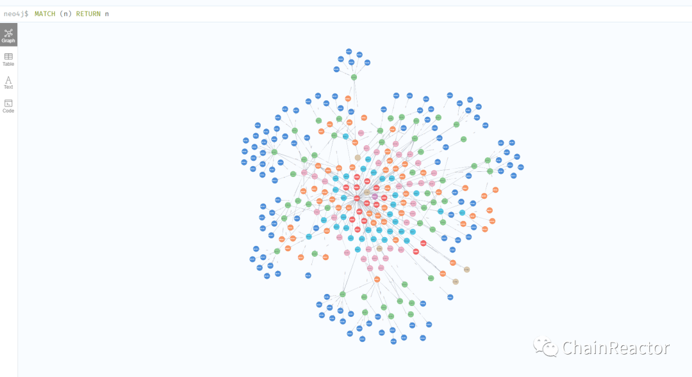

---
date:
  created: 2022-11-15
---

## 前言

在发布chainreactor的计划之前, 先行发布了我们最成熟的工具 gogo, 是希望大家能从gogo中感受到我们的设计上的风格. 接下来将会介绍chainreactor的其他部分.

## 开始

chainreactor 将专注于红队自动化以及红队工具工件化. 如果要找一个类比, 可以参考projectdiscovery. 确实, 我们也从pd参考借鉴了非常多的代码, 甚至部分工具直接移植了pd的代码与poc.

为什么要在projectdiscovery之后再做类似的东西? 当然不是为了成为一个国产化的克隆pd , 因此pd已经覆盖到的场景将直接使用pd的工具链或者给pd提交pr, 而一些pd没有覆盖的场景将会自行研发,例如url被动收集与主动收集, 被动收集dns历史解析记录, 弱口令爆破等.

当然, 这些工件只是计划的第一阶段, 第二阶段则是通过工件化的工具链实现一个可编排, 可拓展, 高度可控的面向红队的框架. 并通过流量中间件实现将工具链拓展到内网. 第一阶段与第二阶段将会同步进行

是的, 我们的目标就是实现一个足够强大的, 高可拓展的, 分布式的, 协作的信息收集与漏扫框架. 这一堆词拼凑出的印象大概就是这两年很火的攻击面管理(ASM), 安全自动化编排与响应(SOAR), 漏扫加上CobaltStrike式的teamserver的集合体.  目标很大, 也许不能完全实现, 因此整个计划的所有组成部分都将以工件化的形式编写, 就算不能完成整个计划, 也有一系列中间成果可以单独使用在各种场景中.

目前这个项目使用业余时间进行了一年多, 完成了一两个成熟的工件, 三四个研发中的工件, 以及demo版本的框架与demo版本的流量中间件.  将会逐步发布, 我相信每个工件都能做到市面上最强或在某些场景下有独特的地方.

<!-- more -->

## 初衷

在红队场景下, 每拿到一个新目标, 就要进行及其繁琐的信息收集工作, 在20年最初开始接触的时候, 这种繁琐的工作可以占用整个流程的80%. 到后来, 很多人摸索出了经验,

当我们开始尝试开发这样的一个工具时, 我发现竟然除了pd之外, 其他工具极少有满足我们的想法的.  总会在各种各样的地方出现无法解决的问题, 而为了解决这些问题, 我们被迫先去开发了一系列工具链.

## 蓝图

我们已经实现了一系列工件以及一个攻击面测绘引擎的demo版本. 不同于github 同类产品, 我们的工具除了pd的部分工具链之外, 其他的工件都选择了自行研发. 并且, 采用了独特的分布式设计以及高度解耦的模块化设计. 让工件能独立运行, 自由组合.

几个终极的目标(因为时间有限, 这个目标可能会非常久远, 但是我们的工具链会先行开源)

1. 实现自动化的信息收集, 拓扑绘制, 指纹与漏洞识别 (这一块同类工具非常多, 请相信chainreactors会带来惊喜)
2. 类似cs的teamserver式的协作半自动化内外网信息收集, 漏洞扫描, 用以填补自动化的不足
3. 足够强的可拓展性, 类似潮汐平台的自动化工具编排. 并不强制使用我们开发的原生的工具链, 也可以自行添加一些用户自己喜欢的工具

这些思路在提出的时候市面上并没有类似的产品, 但是闭门开发了一年多之后, 发现市场上已经有许多类似的创业公司, 只能说这两年hw与红队的需求是类似的. 大家因为有类似的需求, 自然而然的产生的类似的想法. 几乎每隔一两个月, 都会有一些沾沾自喜的创意会有其他人以各种方式公开.

### 工具链目前状态

工具链与框架的需求是相互的, 如果需求复杂到需要一个单独的工具解决, 那就会新建一个项目.

我们将会保留pd的大部分工具, 并在此之上实现pd中没有覆盖的场景. 补全一个完整的工具链.

已经在进行中的工件:

- gogo (端口扫描, 指纹识别, 简易漏洞扫描) 进度: 已完成
- zombie (常见服务的口令爆破与喷洒, 批量执行) 进度:重构中, 即将完成
- spray (主动http爆破, 主动指纹识别等http协议高并发任务) 进度: 重构中,即将完成
- ani  (公司信息爬虫)  进度: 已完成
- ina (空间搜索引擎交叉爬虫) 进度: 已完成
- meta-matrix  (将工件快速分布式化的框架) 进度: 已完成
- maitai (流量中间件, 实现代理与转发以及agent的各种功能) 进度: 重构中

部分工件因为之前在实战中边打边写, 代码质量与设计上存在一些问题, 我们认为还不能够开源, 所以将其中几个工件回炉重造了, 打磨一段时间后将会开放.

规划中的工件:

- urlfinder (被动url收集)
- ipfinder (被动的ip收集)
- kindred-engine (工件的编排调度引擎)

### pd工具链

从pd中获取的工件

- httpx (一些批量化的http协议请求任务与信息提取)
- dnsx (主动的dns信息收集)
- subfinder (被动子域名收集)
- nuclei (漏洞扫描)
- katago (headless爬虫)

#### 为什么要保留projectdiscovery的工具链

1. 极其活跃的社区, 除了那几个效率非常高的核心开发者外, 还有一个活跃的社区, 每天都有数十个issue被处理, pr被合并. 我曾经提交了几个pr, 项目的负责人很快与我对接了需求, 进行review, 修改整理后合并.
2. 优雅且统一的命令行UI, 特别是在输入输出上基本做到了统一, 大大减少学习成本.
3. 足够的可拓展性, 我在给pd提交pr或者二开的时候, 总能感受到pd开发者的考虑充分, 减少了很多麻烦.

因为这几点, 让pd的工具链就算有一些不足, 也能通过自行实现我的需求, 并且还能回馈社区. 因此, 我们决定, 将保留绝大部分pd的工具链, 例如 nuclei, subfinder, httpx, dnsx等等一系列工具.

pd的这些优点也会尽量在我们自行研发的工具链中继承.

### Kindred (终极目标)

我们打算使用这套工件实现的第一个使用场景就是面向红队的攻击面管理(ASM), 暂定命名为kindred-project, 是lol英雄的名字, 也是我之前玩lol时的绝活 --- 永猎双子 lol.

这将是一个以攻击方视角, 同时对内网, 外网, 开源情报的测绘系统, 有许多想法是之前从未有人实践的.

工件化模块化的设计思路下,  各个工件都能够独立使用, 而将其组合编排起来的框架, 这个框架就是kindred的本体. 这部分设计较为复杂, 工程量较大, api几天一改, 因此很长一段时间内都不会开源, 短时间内可能只会开放试用.

目前的状态是已经完成了一个demo, 大概是一个api(调度接口), cli(用户交互), core(数据处理与分析)这样的结构, 后续将会从core中拆出一个engine(编排调度).

因为没有前端, 临时使用了neo4j browser作为目前手动数据处理的UI, 生成的攻击面拓扑图效果是这样的. 当然这个图并不是最终的结果, 还需要大量的数据分析与处理工作, 才能把红队想要的数据提取出来.

我们采用了neo4j(图数据库) 直接作为数据处理分析的核心, 而非将元数据存在关系型数据库中, 然后通过图数据库渲染.  因为我们认为图数据天然契合信息收集场景, 各种资产信息与信息之间的关联就构成了攻击面, 对其进行绘制最直观的解决方案就是一张图.  绘制完这张图后, 再对其中的数据进行二次分析处理, 以及后续复测, 长期监控, 漏洞管理等都是水到渠成的内在能力.

在分布式上, 我们采用了云函数的方式, 让个人也能够部署一个庞大的集群, 并通过兼容各类云函数服务提供商, 构造起一个跨国跨服务商的分布式节点网络. 我个人使用下来, 成本非常低, 一个月只需要几十块的费用. 为了实现这种分布式,  我编写了meta-matrix框架, 可以将一个工件快速部署到云函数, 随用随取, 弹性使用.  

更多的设计思路细节, 将会在后续的文章介绍.

## 结语

我们将毫无保留的公开我们的设计理念与各种实践中积累的经验, 也欢迎社区提供更多的意见, 经验以及pr. 所有的工具链我们都将开源, 但因为主业是红队, 并不能全身心投入到开发中, 有些功能短期内无法完成. 虽然kindred在近期内不能开放, 但是相关的工具链将会在这几个月陆续公开.

目前也有不少与我们想法有重合的创业公司, 但我们将会保持开源, 为社区提供一个开源的选项, 不过为了避免有可能的冲突, 我们的开源协议不会选择商业化友好的协议, 只对个人使用者保持完全的开放.

部分工具正在开发中, 非常多功能没有实现, 也需要充分的测试才能公开, 所以暂时只对贡献者开放试用.

接下来几天, 我们将会发布一部分自认为已经相对成熟的工件, 并介绍设计过程中的一些奇思妙想与实战中面临的问题.

本账号后续的内容会相对硬核, 主要关于设计思路与经验的自动化.