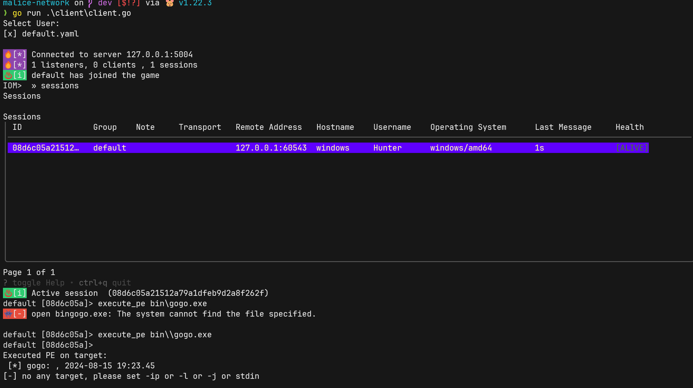
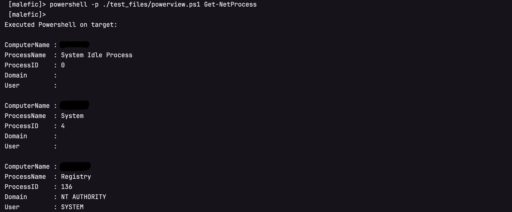
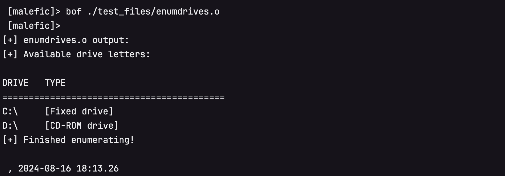
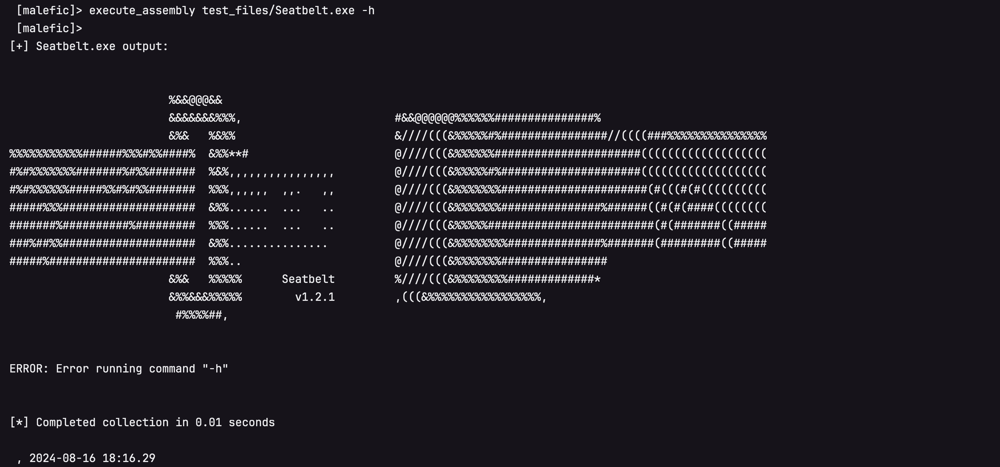

---
date:
  created: 2024-08-16
---

这里可以找到IoM的全部信息 https://chainreactors.github.io/wiki/IoM/

Internal of Malice(恶联网) 力图实现一套post-exploit基础设施, 在兼容CS,MSF,Sliver生态的同时, 提供更高的拓展性与隐蔽性, 并提供一套工程化的解决方案.

<!-- more -->
## 背景

近年来开展的大量攻防活动将网络安全行业推向了实网对抗(Real World), 而不再是模拟环境(CTF), 理论环境(传统网络安全建设)的对抗. 在实网对抗中, 攻击方延申出了三个主要的细分领域:

1. pre-exploit 通过各种方式的信息收集, 找到可以exploit的目标, 这个方向发展出了ASM(攻击面管理), Cyberspace-Mapping(网络空间测绘), VM(漏洞管理)等细分领域的产品.
2. exploit  这个方向有传统的Scanner(自动化扫描器), 今年来也出现了新兴领域 BAS(入侵模拟), Exploit-Framework(漏洞利用框架), Exploit-Platform(漏洞知识库/漏洞交易平台)等等
3. post-exploit 后利用, 这个领域的防守方的防护手段越来越成熟, 有大量 `*DR/HIDS`(端上防护), SOAR(自动化响应), CTI(威胁情报) 设备等等, 但在攻击方视角中, 全部的对抗都凝缩在AS(攻击模拟, 可以理解为C2/Webshell)上. 

上面每个提到的每个偏向防守的细分领域在近些年来都出现了对应的创业公司, 有不少已经成长为庞然大物. 

但对于偏向攻击模拟方向, 一般是由乙方组建的攻击队实施, 其中基建是他们最核心的能力, 需要让这块能力维持黑盒状态以保持对友商的领先. 甲方只能通过购买服务的方式, 至多也只能挖几个经验丰富的红队. 尽管这两年出现了一个新概念BAS(入侵和攻击模拟), 通过使用playbook的方式自动化重放攻击过程, 实现了一定程度上对防护能力的检验, 但因playbook的强度远远小于红蓝对抗的强度, BAS至多成为红蓝对抗的下位替代, 而非SRC之于漏扫这样的补充. 

而在国外出现了不少这个领域(offensive security领域)的创业公司. 国内暂时很难复现他们的路线, 但是至少应该进行一些实验. 

几乎所有企业的绝大部分安全预算都用在对C2(以及相关衍生技术)的防护上, 但在国内却缺少对应的模拟能力. 不论是甲方建设内部蓝军, 亦或是为了红蓝对抗需求的乙方红队或独立红队都需要一套基础设施来模拟或检测. 红蓝对抗的效果是远远优于依赖僵硬的playbook的BAS的.

近年来大型企业都建立了自己的蓝军, 但安全行业只提供防护类产品, 蓝军面临着光有人, 其他的一切都得自己搭建的困难.

### 国外商业化产品

* [CobaltStrike](https://www.cobaltstrike.com/) 开发商outfrank, 近些年最流行的C2框架, 凭借着方便的GUI, 极高的拓展性, 社区以及二开便利优势拿下了最高的市场占有率.  并有一系列的相关领域的工具链, https://www.outflank.nl/products/outflank-security-tooling/ . 随着4.5版本的源码泄露, 有越来越多的基于其源码二开的框架.
* [Metasploit](https://www.metasploit.com/) 开发商rapid7, 拥有最全面的exploit与post-exploit 框架, 市面上能见到的绝大部分自研C2不是基于CS二开就是基于MSF二开.  但也因为过于笨重以及在teamserver方面的劣势, 在实战中并不常见.  有一个基于MSF的teamserver与gui化的开源项目 https://github.com/FunnyWolf/Viper
* [nighthawk](https://www.mdsec.co.uk/nighthawk/) 来自英国的商业化C2框架, 专注opsec, 但因为无公开流出版本, 没有深度体验.  
* [bruteratel](https://bruteratel.com/) 来自美国商业C2框架, 近期有流出版本, 有被apt,勒索组织使用案例. 

### 开源生态

* [sliver](https://sliver.sh/)  开发商bishopfox. 一个新兴的开源C2. 拥有许多独特的功能, 例如cursed, 密码学安全的流量特性等, 以及自己的生态armory. 
* [havoc](https://github.com/HavocFramework/Havoc) implant基于C开发, 通过兼容BOF获得了不少CS的能力. 
* [mythic](https://github.com/its-a-feature/Mythic) 本质上是一套通讯协议， 实现了这个通讯协议的agent可以与这个框架交互.

从基础功能上来说, 基本功能之间大同小异, 稳定运行的implant, 适合团队协作的teamserver, 便利的客户端. 商业化工具与开源工具最大的区别是在OPSEC上, 其中做得比较好的是nighthawk与cobaltstrike, 他们拥有大量未公开的EDR对抗技术, 并有良好的工程化与自定义方案。

在这个领域里, 社区的繁荣往往意味着更大的免杀难度, OPSEC难度. 

而在国内并不缺少单独的EDR对抗技术, 有大量公开或未公开的技术在开源世界或者私下流传, 但缺少一个可以高度定制化的框架将这些独立的技术工程化, 使其变成一个统一的基础设施. 

nighthawk与cobaltstrike都是闭源的工具, 他们虽然提供了各种接口以供用户客制化, 但在最核心的部分, 因为缺少代码, 只能依赖其官方迭代. 并且nighthawk与cobaltstrike都有严格的对中国出口限制.

**最重要的是, 国内的环境诞生了一系列强大的webshell管理工具, 他们实际上也是某种意义上的C2, 从工程上来看, 理论上能完全复用C2的后渗透基建.**

可以想象一个能调用cobaltstrike的cna脚本的冰鞋/哥斯拉有多么强大! 
## IoM 设计理念

当我们真正开始着手去实现时, 遇到的困难比想象多得多.

我们调研了开源世界中大部分知名C2的架构与实现, 80%以上C2实际上只实现了命令执行, 上传下载. 说实话很难称得上是C2.

但也发现了有几个实现非常成熟的, 从架构与设计上都非常优雅的框架. 也就是在背景中提到过的sliver, havoc, mythic. 这三个框架的架构完全不同, 各有各的优缺点. 

总结出了一些下一代C2核心设计理念. 

* rust是下一代C2的理想语言, 提供了底层操作能力, 跨平台编译, 能修改几乎一切特征
* 模块化, 热插拔, 高度可定制的implant设计. 我们将一切功能都拆成一个一个积木, 通过rust提供的feature与条件编译实现任意组合. 
* 支持webshell, 并打通与底层的操作能力, 复用C2的插件生态, 例如CLR生态的assembly-execute的能力, java的JNI和JVMTI等等.
* OPSEC优先, 并尽可能开放的OPSEC自定义接口
* 在流量上的高度可控
* 从C2到bootkit/rootkit
* listener与server要解耦, 下一代C2天生就应该是分布式的
* 对原有C2生态的兼容, 例如CobaltStrike的BOF, Sliver的Armory等
*  ......

我们将这些设计理念细化成详细的需求表, 并正式开始去构建下一代C2.

现在可以在 [IoM roadmap](IoM/roadmap) 中找到我们的具体计划与路线图.

### snippets

IoM将在v0.0.1-community发布的一些功能展示. 

**反射加载EXE文件** (headless PE)

**注册插件**

**unmanaged powershell**

**bof**

**进程内执行 CRL exe**

And More...

可以在这里快速开始尝试IoM: https://chainreactors.github.io/wiki/IoM/quickstart/
### 防止滥用

作为一个带有攻击性的工具, 我们知道这么做的风险. 我们在公开设计理念, 程序代码的时候进行了一定的过滤. 将其分为`community`与`professional` (将会比community晚一段时间发布), 以及未来有可能出现的 `business` . 

* community
	* 包含了client/server的完整代码
	* implant的主体的源代码
	* 没有进行OPSEC优化 kits的编译时静态库文件. 目前提供了win-kit
	* 所有有关插件化, 拓展能力的功能都将会出现在community中.
* professional, (发布时间待定, 就在近期, 可能会有一定的安全性审核与贡献要求)
	* 免杀框架, 
	* 进行了大量OPSEC优化的kits
	* 高级代理/流量功能

## redboot计划

以统一的设计风格去重构各个细分领域"**allinone**"工具, 去实现以人为核心的红队工具链与工程化实践, 我们将其命名为 **redboot** . reboot 最终计划实现面向 **面向红队** 的 **一体化平台** ,提供一整套完整的 **红队工程基础设施** .

通过工件之间的 **链式反应** 以达到 **临界质量** .

IoM只是redboot计划的三个支线之一, 也是第一个发布的支线.  未来一段时间我们将全力维护这个项目.

并在计划今年内发布另外两条支线的红队向的ASM与我们的代理工具. 

### Thread1 IoM
[IoM](IoM) https://chainreactors.github.io/wiki/IoM/

IoM(`Internal of Malice`) 的定位是下一代C2框架, 同样以高度模块化与可拓展性为核心设计理念. 基于这个理念去实现插件化的OPSEC, 插件化的社区生态, 插件化的一切.

更重要的是, IoM将结合C2与webshell, 将同一套插件化的基建共享给完全不同的后渗透场景. 

IoM即将发布v0.0.1, 这个版本离我们最初的v0.0.1设计目标还有很多遗憾, 但是为了防止闭门造车, 我们想提前从社区中接收反馈.

目前提供了IoM的[设计文档](/wiki/IoM/design)与[用户手册](/wiki/IoM/manual) ,可以在[这里](https://github.com/chainreactors/malice-network)体验到IoM的v0.0.1

### Thread2 mapping

[mapping](mapping) https://chainreactors.github.io/wiki/mapping/ *预计在2024年内发布*

ASM是chainreactor的初衷, gogo/spray/zombie之类的工具实际上都是为了这个目标设计的. 通过极高的拓展性与细粒度实现的完全可控的攻击面管理引擎.

现在这个目标已经完成了v0.0.1, 但因为一些数据源与部署方式的问题, 暂时无法发布. 

目前提供了mapping的[设计文档](/wiki/mapping/design), 可以在这里看到mapping作为红队向的协作式攻击面引擎的设计理念.

### Thread3 rem

https://chainreactors.github.io/wiki/rem/ *预计在2024年内发布*

rem是全场景的流量/代理工具. 能用来解决绝大多数场景的代理与转发需求, 也用来打通mapping与IoM, 让mapping能通过rem+IoM接入内网. rem提供了在传输层, 应用层, 加密层, 混淆层的拓展接口. 可以被轻松修改为自定义特征, 也将是IoM在流量端的能力拓展. 

目前提供了rem的[设计文档](/wiki/rem/design) 与 [路线图](wiki/rem/roadmap)