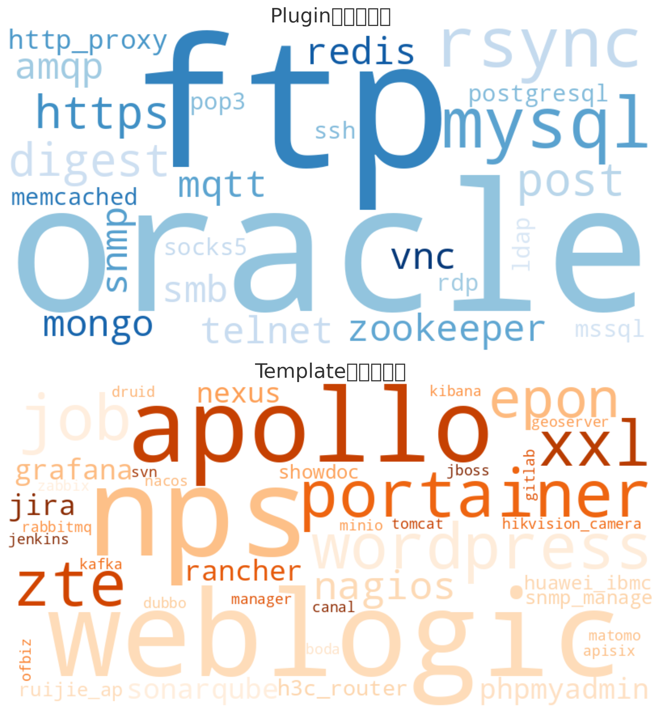

---
date:
  created: 2024-06-07
slug: zombie-introduce
---

## Overview

zombie是gogo设计之初就诞生的一个计划，中间写了好几版(早期版本@PassingFoam)，搁置了快一年。正巧有几个朋友一直在关注这个工具，才把它从内部使用的工具变成基本可用的工具。虽然拖了一年多，但它绝对是目前地球上最强大的爆破工具。

[zombie](https://github.com/chainreactors/zombie) 从1.0就public了。但是因为bug、协议支持、用户体验、兼容性等各种问题，一直不愿写一篇介绍它的文章。至今寥寥几十个star，估计都是长期关注的小伙伴。

到前几天发布的v1.1.6，zombie应该勉强可以出来见人了。与gogo以及之前的其他工具同样，zombie也将是一个长期维护的项目，也是chainreactors工件库中新的一环。

<!-- more -->

## 设计

本文将不赘述zombie的使用方法，具体请见

https://github.com/chainreactors/zombie

https://chainreactors.github.io/wiki/zombie/

### 开源世界

重新设计一套工具之前得先关注这个领域的前辈。

- [hydra](https://github.com/vanhauser-thc/thc-hydra) 每个人都用过的爆破工具，命令行简单直白。但也会发现，日站越熟练就用得越少，和它编译麻烦、性能较慢、没办法跨平台等问题相关。不过阅读它的源码会发现，它对每个协议的支持都是原生的，直接通过socket实现，而不是引入第三方库。
- [medusa](https://github.com/jmk-foofus/medusa) 和hydra非常相似，性能和设计上都差不多，缺点也是类似，编译麻烦，性能较慢，没办法跨平台。
- [SNETCracker](https://github.com/shack2/) "超级弱口令检测工具"，有一段时间老是出现，甚至在目标的内网机器上都找到过友商上传的记录。带有gui，上手快，但性能差，复杂场景无法支持(例如给非默认口令的服务爆破都无法做到)。支持的协议也不是很多。在一些有windows相关协议上支持比较好，如rdp。
- [legba](https://github.com/evilsocket/legba) 一个用rust编写的较新的爆破工具，我第一眼看到它的时候一度觉得zombie项目可以停止了。但实际使用了一次，发现hydra有的问题它竟然完美地保留了，除了rust的tokio提供了更强大的多线程性能外，依旧是无法跨平台，编译麻烦之类的问题，支持的协议也没那么多。反而让我更迫切地完成zombie项目。
- 其他，这两年也出现了fscan、kscan等等带有爆破功能的扫描器，但不知道有没有人发现，使用fscan的时候从来没扫描到过非默认端口的弱口令(😊)，因为fscan硬编码了端口号，并根据端口号进行爆破。诸如此类问题，他们的爆破能力对比hydra来说反而是退步了。

从开源世界来看，其实急缺这么一款工具。从zombie的第一行代码到public过了两年，但除了legba略微有些新意之外，并无改变。

### 设计目标

Zombie的设计之初有几个目标：

1. 简洁的命令行设计，参考了hydra的命令行设计。
2. 支持足够多的服务，包括各种web服务，目前已经支持了数十个服务。(通过原生插件与neutron引擎实现了)
3. 联动gogo。gogo为了轻量且无依赖放弃了很多功能，通过zombie补全gogo的短板。
4. 批处理，不只是拿一个密码爆破相关服务，而是拿爆破可爆破的一切。
5. 支持动态生成字典，重写了hashcat的rule与mask生成器。
6. 支持一定的后渗透能力 (类似crackmapexec，目前还未实现)。

在凭证爆破这个场景，zombie希望能解决所有问题。不仅仅是尽可能全的协议适配，同时还要解决自动化与字典问题。

## 介绍

### 协议覆盖面

现在的zombie（截至v1.1.6），支持39种template配置的服务，27种go原生插件实现的服务。光从协议支持来比较，已经是地表最全面的爆破工具（部分协议缺少测试）。

当前这66种协议只是个开始，理论上需要覆盖所有可爆破的攻击面。也将是解决密码复用问题的终极解决方案。

### 密码复用的杀手

*下图为测试环境中简单配置测试*

尽可能全的协议覆盖并不是zombie的终极目标。

甲方拿着开源或者商业化的扫描器扫了一遍又一遍，但是攻防一打，总有那么一个通用口令，能打死一片直接被刷出局。

**扫描器只能扫弱口令，不能解决口令复用**

商业化的解决方案，例如1password这类密码管理器或bitwarden这样的团队密钥管理工具。又或是nacos，apollo这类配置中心（有些人会拿他们当密码管理器）。解决的是密码如何管理的问题，就算加了随机生成密码的功能，也不能保证用户每次都会使用。总有人贪图方便将用一个通用密码作为所有业务的密码。

还有另外一类商业化的解决方案，如堡垒机/运维机/云管，同样解决不了这个问题。第一个问题如已有服务加到堡垒机时，极少会修改一次密码，所以依旧经常能看到一个私钥/密码打死一大片的情况。其次将root用户加到堡垒机中，不代表这个服务只有这一个用户，为了运维方便，用户可能会添加其他运维用户，例如zabbix，ansible等等。

而zombie就是密码复用的杀手，只需要接收gogo的扫描结果（也支持用户自定义生成的json文件），zombie就能从gogo的指纹中选取合适的服务，拿着密码本对所有服务进行一次测试。

不少工具或多或少的支持配置通用密码本，但必定不如将这个加到设计理念中的zombie。

### 困难

zombie遇到的许多困难目前也没较好的解决办法。

**蜜罐与未授权的区分**

zombie的扫描逻辑:

1. 随机账户密码的check-honeypot测试，用来检测是否为蜜罐
2. 指定默认账户、默认密码(部分情况下为空)的未授权/默认密码测试，检测是否是空密钥
3. 根据字典开始爆破

但如ftp、mysql，如果密码为空，则任意密码都能登录。因此无法区分是蜜罐或是未授权。

**兼容性**

有多个库已经无法在go1.10上编译，也就是说zombie无法运行在windows xp/windows server 2003上。

**更大的困难还有同一个服务支持多种认证方式，甚至不同版本也需要不同的认证方式。**

- rdp、smb这类windows协议，支持的认证方式特别多，但因能力有限，只能支持最常用的。并且还会因为协议版本的不同，出现大量漏报、误报问题。需要更多的反馈修复。
- oracle、postgre、mongo协议支持多种认证方式，也暂时没有能力一一适配。
- telnet、http协议会因为每个服务的实现方式不同，都需要一一手动适配。

这些困难可能会需要向社区求助才有可能一一解决。

**未来还将面临更复杂的场景。**

在我的设想中，zombie应该要如crackexecmap那样，批量进行利用。如此多的协议将这个需求的困难放大了无数倍。目前看来还没有很好的解决办法，只能等待工具链的进一步成熟，才能对这样复杂的需求进行适配。

开源世界缺少成熟的exploit框架，连商业化产品也只能通过堆人力的方式实现一个一个漏洞的兼容。其实绝大部分工作都在重复造轮子，也让zombie无法将其扫描结果传递到下一环。

## End

之前在写gogo时, 实现了一个无依赖的nuclei template的nano版本解析引擎[neutron](https://github.com/chainreactors/neutron), zombie得以不需要重新造轮子, 直接复用的了gogo的成果. 也从nuclei-template集成大量default-login相关的poc, 简单移植之后, 这些poc的能力都得到的增强, 不再是只能爆破默认密码.  感谢projectdiscovery的工作, 标准化的poc生态, 能让后人减少大量的重复工作.  zombie的原生插件也将反哺projectdiscovery工具链无法实现的大量服务的爆破功能.

zombie是一个践行了chainreactors(链式反应器)设计理念的工件. 在最近的一些反馈与测试中也取得了极好的效果.  欢迎各位体验,提供反馈.

*到大活动开始前, 还会发布gogo从发布以来的增强介绍, 与spray的1.0版本*
