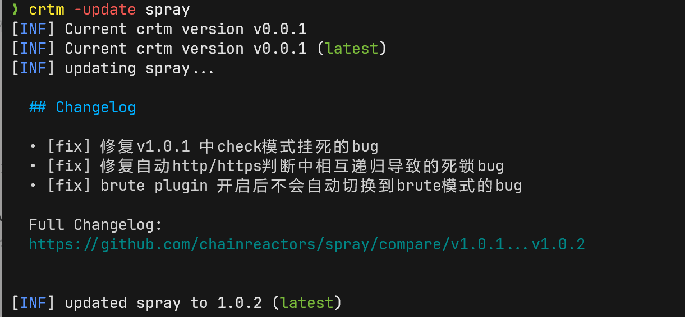

---
date:
  created: 2024-08-25
slug: spray-best-practices
---

本文提到的工具: https://github.com/chainreactors/spray
## 前言

之前在 [为什么我们需要收集URL?](/wiki/blog/2023/12/31/spray-introduce) 发布了两个工具, 分别是用来爆破目录的[spray](https://github.com/chainreactors/spray) 和用来被动收集url的 [urlfounder](https://github.com/chainreactors/urlfounder).  

urlfounder在发布后基本没进行更新,  但是spray经过一年的进化, 迎来了v1.0.0版本. 定位也从一个目录爆破工具变成了全面全能的WEB信息收集工具. 

它拥有目前最强大的性能与最智能的算法. 几乎能覆盖dirsearch + httpx + 指纹识别(fingers) + fuff的全部功能.

<!-- more -->

## 最佳实践

前段时间, 发布了指纹识别引擎fingers(https://github.com/chainreactors/fingers), 这个引擎不包含发包能力, 只能传入`http.Response`或`bytes` 返回用来描述指纹全部信息的`Frameworks`结构.

因为fingers在设计上就是作为gogo/spray的库使用, 发包能力是在gogo/spray中实现的. gogo坚持最小发包原则, 放弃了很多指纹识别的机会. 但spray没有这些限制, 通过了一些系列指纹识别相关优化作为**fingers的最佳实践指南.** 

发包器很直观的理解就是发出去request, 收获response, 看起来很简单是不是？

### 性能

而其中第一个问题 **性能**. 

需要注意, 这里指的性能不是通过提高并发数就能达到的性能. 过度提高并发数, 只会造成类似的DOS的效果, 发包端和收包的服务都有可能因为响应时间的提高而导致timeout 甚至造成服务宕机. 

实际上, HTTP协议和golang本身就提供了不少性能优化的手段, 这些手段能最大效率利用带宽, 物理资源, FD等等资源. 最大程度利用库提供的连接池, HTTP协议提供的链接复用等特性可以让程序的性能好几个数量级的爆杀基于python的工具(dirsearch, dirmap等), 更能超过没有经过精心调制的rust工具(rustscan, feroxbuster)

> **有人提到rustscan 3s 6k端口很快, 但实际上golang做到3s 60k也没多大困难. 在HTTP Fuzz/目录爆破场景下, 还触及不到语言带来的性能优势**

spray提供了两种client(标准库http和fasthttp), 以及两种模式check和brute. 分别根据不同的场景进行了不同的性能优化. 

以brute模式下的标准库http. (优化点写在注释中)
```
standardClient: &http.Client{  
    Transport: &http.Transport{  
       TLSClientConfig: &tls.Config{  
          Renegotiation:      tls.RenegotiateNever,  // 禁止server端重新tls握手
          InsecureSkipVerify: true,                  // 忽略tls证书校验错误
       },  
       TLSHandshakeTimeout: config.Timeout,         // tls握手时间限制
       MaxConnsPerHost:     config.Thread * 3 / 2,  // 单个目标最大连接数, 指的是TCP连接, 通过keep-alive复用,防止大量重新建立的连接DOS目标. 性能优化的核心
       IdleConnTimeout:     config.Timeout,  // 空闲连接超过指定时间释放(默认2s)
       ReadBufferSize:      16384, // 16k   // spray认为16k的数据以及足够获取所有指纹
    },  
    Timeout: config.Timeout,                // 全局timeout, 方式过度等待
    CheckRedirect: func(req *http.Request, via []*http.Request) error {  
       return http.ErrUseLastResponse      // 限制重定向次数, 防止无限循环
    },  
},
```

做到合适的使用http协议的基本配置, 就能超过90%的扫描器了. 剩下的10%还需要一点黑魔法. 

**fasthttp与net/http包更是快上了数倍.**

fasthttp通过复用buf, 优化解析器, io复用等手段可以让性能巨额提升. 只要合适配置其client, 性能可以爆杀一众基于rust开发的扫描器(性能好过feroxbuster 50%). 在本机nginx测试(避免网络带来的影响)下, 最快速率能到20w/s(包含生成请求与解析响应的完整过程, 而非只发包).

fasthttp的配置方式与优化http差不多. 有兴趣可以在代码里找到. 

### 收集

然后就是如何覆盖到存在指纹的页面了. 这里就是考验指纹收集的核心能力了.

1. 指纹存在于每个包中, 例如http的header.
2. 指纹存在于特定页面中, 通过主动探测指定目录解决
3. 指纹是供应链指纹, 有一些供应链特有的开发习惯
4. 指纹是开源组件指纹, 可能存在犄角旮旯里
5. ...

我们来分析一下这些常见场景(实际上比这复杂的多).

绝大部分工具只能覆盖其中的第一种, 也就是根据index页面匹配字符串或正则. 例如[ehole](https://github.com/EdgeSecurityTeam/EHole), [kscan](https://github.com/lcvvvv/kscan/)

能满足第二点的, 也就是支持指定主动识别指纹目录的, 已经少了很多, 例如 [observer_ward](https://github.com/emo-crab/observer_ward), [xapp](https://github.com/chaitin/xapp), 这两个工具可以配置主动发包路径.


要实现第一和第二点并不复杂, 那么第三和第四点改如何实现呢? 

实际上已经不存在通用的解决办法了. 将变成一系列的规则交叉组合实现. 

例如供应链和开源组件指纹, 可能只存在于某一个页面中

* 那么我们的目标就变成了尽可能多的发现目录;  
* 如果目标存在基于path的反向代理. 那么我们的目标就变成爆破; 
* 如果目标是一系列相似的api, 那么就变成枚举或者爬虫;
* 如果信息存在于通用文件中, 例如`robots.txt`, `README.md`, 各种编译文件, 依赖文件等, 还需要爆破通用文件目录. 
* .....

而每次收集到第三/第四类的指纹, 很大概率都意味着单点突破. 这类指纹是其他人很难发现, 很难关注的, 也是防守方自己也关注不到的. 

在spray中, 提供了刚才提到的所有这些的解决方案. 

spray最初设计是用来目录爆破的, 但是在实战中多次通过基本信息收集发现各种关键信息带来突破时, 才真正意识到了目录爆破是为了什么服务的. 这时候, 目录爆破的目的就从越来越多的字典变成了**高效且精准**.

有人提出过疑惑spray的下一代体现在哪里。 现在可以给出答案了。 

下一代HTTP Fuzz工具的几个特性: 

* 高性能
* 支持同时爆破多个目标, 体现在: 批量输入与断点续传
* 多种方式的信息收集, 体现在: 敏感信息规则库+fingers指纹库
* 多种方式的目录生成, 体现在: 爬虫, 字典生成器, 递归生成器, 通用文件生成器, 备份文件生成器...
* 智能化判断, 尽可能少的人工介入
* 支持与漏洞利用工具的联动
* ......

## 从目录爆破到全面的WEB信息收集

spray 经过了36个版本的迭代。 平均每个版本都会有1-3个feature. 不到一年时间, 已经是"面目全非"了. 

spray从社区中接收了大量的提议, 现在版本号来到了v1.1.0, 本文也是等待大版本更新带来了较多bug修复后才发布. **感谢bug的反馈者们.**

### 重点改动

* 默认使用模式变成了信息收集模式, 爆破现在只是spray的一种用法， 而不是全部。
* 极大加强了指纹能力, 指纹能力的详情在前一天的[指纹识别的终极解决方案](todo)中介绍. 
	* 新增`--active`支持主动指纹识别
	* 新增`--finger` 可以开启多指纹引擎识别
	* 重构了`--recon` 现在支持更丰富的配置, 类似HaE能从响应包中提取敏感信息
* 重构了输出显示与日志, spray的输出与输入是被诟病最多的地方. 现在这两个点都得到了极大的优化
* 支持了diesearch的绝大部分特性并采用dirsearch的默认字典
* 支持内置预设字典
* 支持通用目录, 备份目录, 爬虫, 主动指纹识别爆破, 并信息收集
* 支持配置文件, 用户可以保留自己的预设
* 重构了关于插件的特性, `--common` 与`--bak` 有更强大的能力了

### 其他更新

* 支持socks5/http代理
* 支持自定义HTTP method
* 支持http raw格式输出
* 支持标准输出的json输出
* 优化爬虫的规则、输出、作用域等
* 简化了关于fuzzy部分的操作
* 大量bug修复
* 
* ...

### UI与交互

**(选择演示的目标是阿里云上的随机网段, 并不存在任何攻击请求)**

现在的spray默认使用方式变成了类似gogo的用法, 爆破不再是spray唯一使用方式.


当然爆破功能还在, 并且有了新的UI


### rule的高级用法

这是spray设计中非常重要的功能, 但是因为存在一定门槛, 用过的人并不多. 

https://github.com/chainreactors/templates/blob/master/spray/rule/authbypass.rule


这是基于rule实现的java权限绕过的规则配置, 可以通过`--append-rule authbypass`使用这个预设的规则. 

如果发现了有效目录, 例如其他目录都是404, 但是某个目录存在403, 通过403的模糊过滤, 就会使用这个规则对有效目录使用这个rule进行生成. 

`spray -u http://example.com --append-rule authbypass --debug --fuzzy`

会生成类似这样的payload, 就像那些专门用来bypass auth的扫描器那样, 但是更加智能与自由.


当然可以指定更多的预设用户自己的payload规则

`spray -u http://example.com --append-rule authbypass --append-rule extbypass --append-rule custom.rule --debug --fuzzy`

### 内置字典

spray在构建完各种信息收集能力之后, 终于可以建设目录仓库.

当前仓库位于: https://github.com/chainreactors/templates/tree/master/spray/dict


spray将有选择性的开始添加通用目录字典. 更倾向于某个组件/技术栈的字典单元, 而非allinone的大字典. 

因此除了[dirsearch的默认字典](https://github.com/chainreactors/templates/blob/master/spray/dict/default.txt)外, 当前其他字典均为此类(部分字典来源于 https://github.com/cpkkcb/fuzzDicts and https://github.com/insightglacier/Dictionary-Of-Pentesting) .

通过使用特定组件的字典, spray将会更加有选择性的进行深度信息收集. 

### 小结

这里只提到了一些相对重要的改动, 更多的特性都没有详细介绍, 需要使用者在文档中自行查阅. 

spray将作为后续ASM工具中关于目录爆破, web信息收集, web fuzz的能力提供单元(artifact). 致力于满足在大规模, 分布式, 复杂使用场景的下一代Fuzz工具.  通过上述各种能力的组合使用, spray可以在不进行poc测试的情况下收集到几乎所有作为测试者需要知道的信息. 

## 讨论

spray在v1.0.0发布后将引来一些重要的改动. 我们想从社区的使用者来提升spray的能力. 

我们有了新的想法:

> 目前使用spray最大的困境可能还是没有一个很好的字典. 但制作字典除了手工整理之外几乎别无二法.
> 但如果使用spray的人足够多, spray可以通过收集部分数据来提高spray各方面的功能.
> 
> - 提高指纹准确度, 筛选无效指纹
> - 改进过滤算法, 减少手动配置
> - 整理目录字典
> 
> 因此, 是否能接受spray新增回传脱敏数据到云端的方式来提高工具本身. 为了保证安全, 可以做出以下保证.
> 
> - 数据将会去掉目标部分(包括url, 跳转后的url, title), 只回传baseline基本信息(length, path, status), 指纹数据
> - 该功能可以通过参数关闭
> - 该功能的各个相关组件(包括云端部分)保持开源, 并通过github action自动编译
> - 收集的数据只用于提高spray以及chainreactors相关工具的能力

可以在 https://github.com/chainreactors/spray/issues/43 中发表你的看法, 是否能接收spray进行这种程度的信息回传

## TODO

* 更强大的extract配置, 能能达到HaE的效果. 或者说spray实际上是想实现主动版本的HaE+CaA. 
* 与nuclei的联动
* 重构递归相关功能, 带来更强的目录发现与指纹发现能力
* 通过社区提供的增强, 请见: https://github.com/chainreactors/spray/issues/43
* 更丰富的预设， 例如优化403 bypass, auth bypass, 备份文件发现等

## 其他
### CRTM
*小工具就不编写独立的编写相关文档与博客了*

https://github.com/chainreactors/crtm

crtm是fork了projectdiscovery的pdtm的工具管理器. 

能用来管理chainreactor相关工具链的更新和安装以及环境变量.




### mapping

mapping 是redboot计划中的三条支线之一, 用来实现红队向的ASM.   spray, fingers, gogo等等都是mapping中的一个组件. 

mapping现在提供了预览文档与设计理念, 可以在 https://chainreactors.github.io/wiki/mapping/ 中阅读


