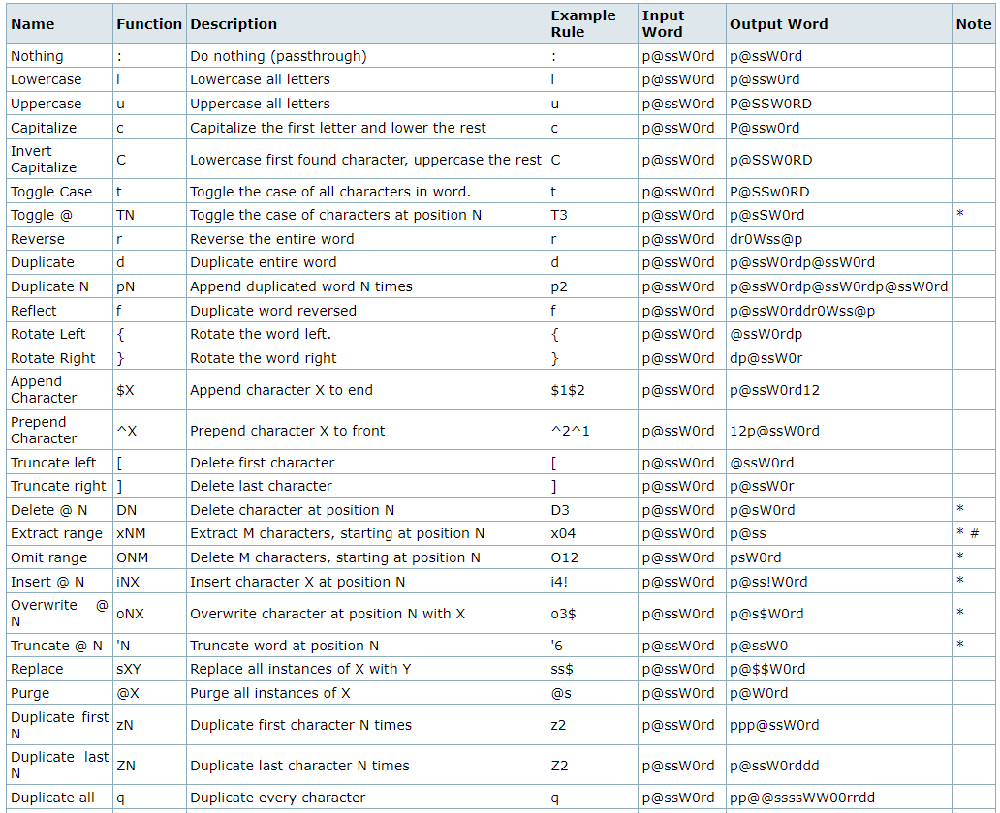

https://github.com/chainreactors/words

## overview

该库作为[spray](https://github.com/chainreactors/spray)和[zombie](https://github.com/chainreactors/zombie)的基础能力的一部分, 是 hashcat 的 rule/mask 生成器的 go 重构(并不完全一致)。

### 基于掩码的字典生成

为了实现这个功能, 编写了一门名为 mask 的模板语言. 代码位于: [mask](https://github.com/chainreactors/words/tree/master/mask).

一些使用案例

`spray -u http://example.com -w '/{?l#3}/{?ud#3}`

含义为, `/全部三位小写字母/全部三位大写字母+数字`组成的字典.

所有的 mask 生成器都需要通过`{}`包裹, 并且括号内的第一个字符必须为`?`, `$`, `@`其中之一. `#`后的数字表示重复次数, 可留空, 例如`{?lu}` , 表示"全部小写字母+全部大写字母"组成的字典.

- `?` 表示普通的笛卡尔积. 例如`{?l#3}`表示生成三位小写字母的所有可能组合
- `$` 表示贪婪模式, 例如`{$l#3}`表示 3 位小写字母的所有可能组合+2 位小写字母的所有可能组合+1 位小写字母的所有可能组合
- `@` 表示关键字模式, 例如`{@year}`, 表示年份, 1970-2030 年.

掩码的定义参考了 hashcat, 但是并不完全相同. 目前可用的关键字如下表:

```
"l": Lowercase,  // 26个小写字母
"u": Uppercase,  // 26个大写字母
"w": Letter,     // 52大写+小写字母
"d": Digit, // 数字0-9
"h": LowercaseHex, // 小写hex字符, 0-9 + a-f
"H": UppercaseHex, // 大写hex字符, 0-9 + A-F
"x": Hex,          // 大写+小写hex字符, 0-9 + a-f + A-F
"p": Punctuation,  // 特殊字符 !\"#$%&'()*+,-./:;<=>?@[\\]^_`{|}~
"P": Printable,    // 可见的ascii字符
"s": Whitespace,   // 空字符 \t\n\r\x0b\x0c
```

支持通过数字表示命令行输入的字典序号, 例如

`spray -u http://example.com -w '/{?0u#2}/{?01}' -d word0.txt -d word1.txt`

其中`{?0u#2}`表示 word0.txt 的所有内容+所有大写字母笛卡尔积两次, `{?01}` 表示 word0.txt + word1.txt 的所有内容.

关键字目前还在不断完善中, 欢迎提供需求.

### 基于规则的字典生成

实现 rule-base 的字典生成器同样编写了一门模板语言, 代码在 [rule](https://github.com/chainreactors/words/tree/master/rule)

规则语法请参考 [hashcat_rule_base](https://hashcat.net/wiki/doku.php?id=rule_based_attack)

目前除了 M(Memorize)的规则已经全部实现. 并且去掉了 hashcat 的一些限制, 比如最多支持 5 个规则, 字符串长度不能大于 10 等.

目前实现的规则如下表， 来自 hashcat 文档



目前支持的过滤规则如下表:


**rule 理论上应该要与 hashcat 的 rule-base 结果完全一致, 但如果与 hashcat 的结果不一致, 请提交 issue.**

[这里有一些 hashcat 自带的规则示例](https://github.com/hashcat/hashcat/tree/master/rules), 但 hashcat 一般用来生成密码字典, 因此对于目录爆破的规则还需要重新积累.
